# 演習 1: Safe Travels エージェントを作成して Microsoft Teams に展開する

### 推定所要時間: 30 分

## 概要

この基礎演習では、Microsoft Copilot Studio の Safe Travels テンプレートを使用して最初の AI エージェントを作成します。これは実践的なハンズオンの導入であり、Microsoft Teams に展開された動作する旅行アシスタント エージェントが得られます。

Safe Travels エージェントは、従業員の旅行関連の質問、ポリシー情報、およびガイダンスを支援します。テンプレートを使用することで、強力な AI エージェントを簡単に作成できることを実感できます。この演習は、あらゆるビジネス シナリオに適用できるコアなエージェント開発のワークフローに慣れることに重点を置いています。

## 目的

次のタスクを完了します:

- タスク 1: データ テーブルをインポートし、Copilot Studio に移動する
- タスク 2: テンプレートから Safe Travels エージェントを作成する  
- タスク 3: エージェントの機能をテストして検証する
- タスク 4: Microsoft Teams にエージェントを公開して展開する

## タスク 1: データ テーブルのインポートと Copilot Studio への移動

このタスクでは、必要なデータ テーブルを Power Platform 環境にインポートし、エージェントの作成を開始するために Copilot Studio に移動します。

1. Power Apps ポータルに戻り、前に作成した環境に切り替えます。

   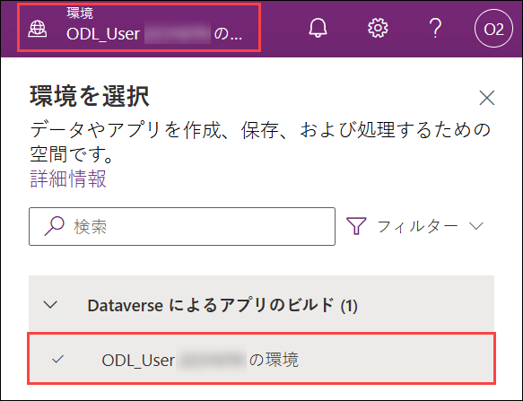

1. 完了したら、左メニューから **Tables (1)** を選択し、**Create with Excel or .CSV file (2)** をクリックします。

   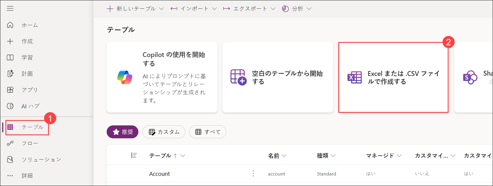

   > **注意:** アクセス権がない旨のメッセージが表示された場合は、**Switch and create** をクリックします。

   

   > **注意:** 直接 **Upload an Excel file** 画面に移動した場合は、**Cancel** をクリックして戻ります。

   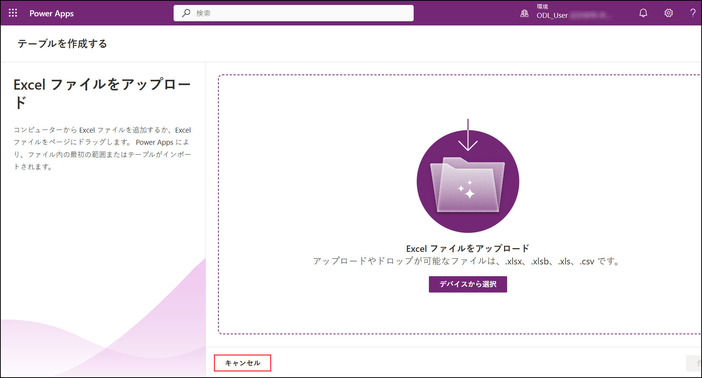

1. 次のペインで **Select from device** をクリックし、ポップアップ ウィンドウでファイルを選択します。

   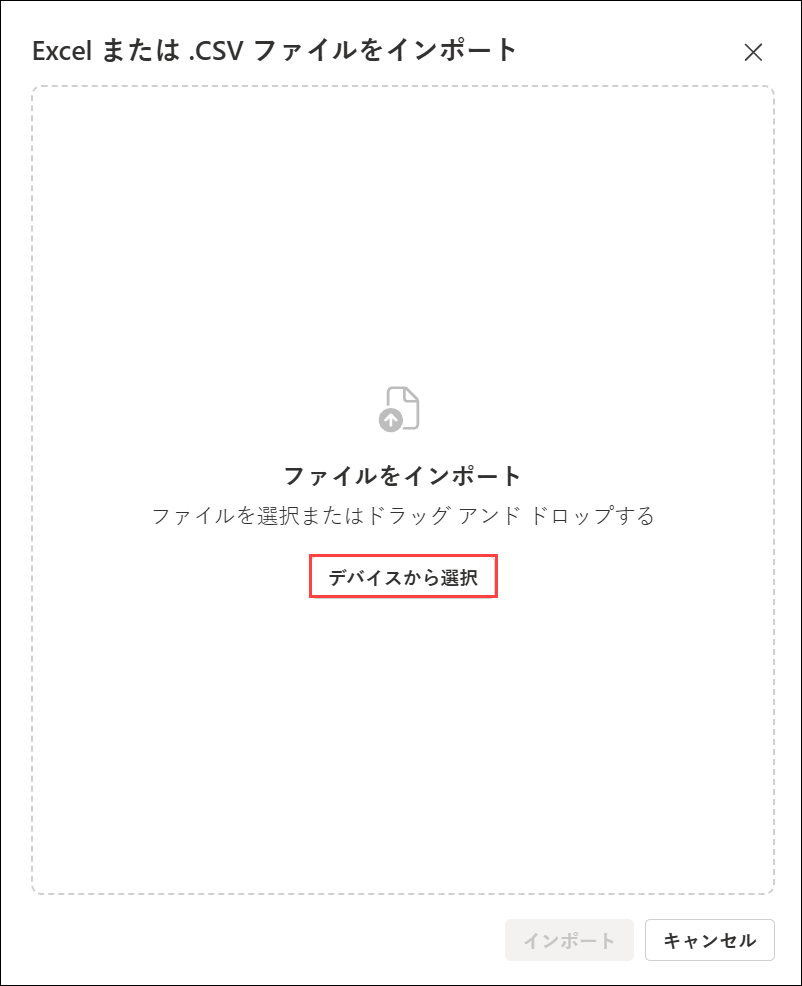

1. ファイル ピッカー ダイアログで:
   - **`C:\datasets\Safe-Travels-Agent-Automate`(1)** に移動します。
   - **Leave balance Tracker.xlsx (2)** を選択します。
   - **Open (3)** をクリックしてファイルを追加します。

      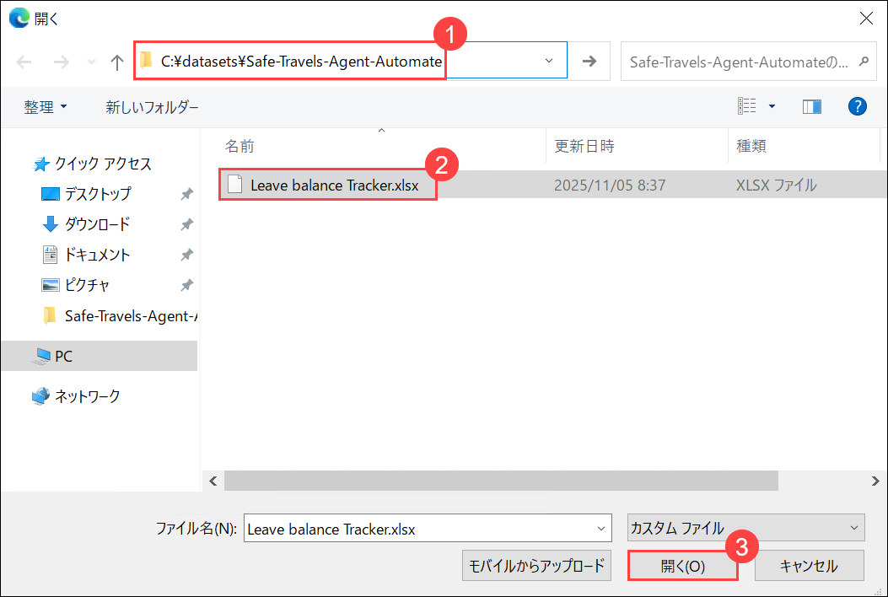

1. **Import an Excel or .CSV file** ペインでテーブルが含まれていることを確認し、**Import** をクリックします。

   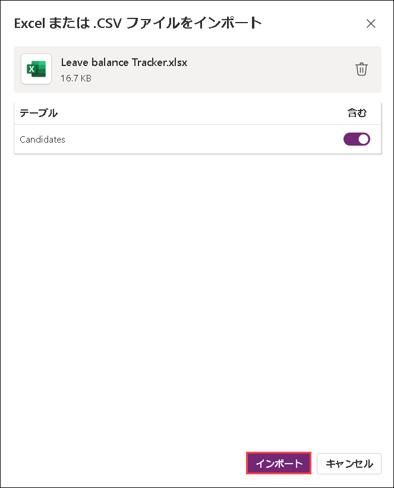

1. テーブル マッピング画面で **Save and exit** をクリックします。

   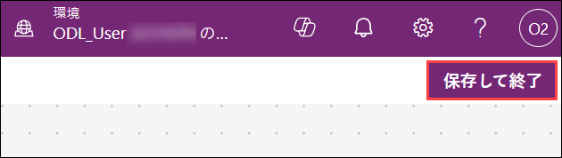

1. **Done working?** ダイアログで **Save and exit** をクリックします。

   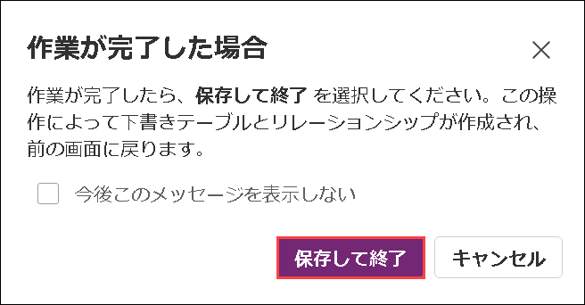

1. プロビジョニングが完了したら、**Tables (1)** を開き、**Employee (2)** テーブルが一覧に表示されていることを確認します。将来の自動化でテーブルを一意に識別する論理的な **prefix (3)** に注意してください（このラボではこれ以上使用しません）。

   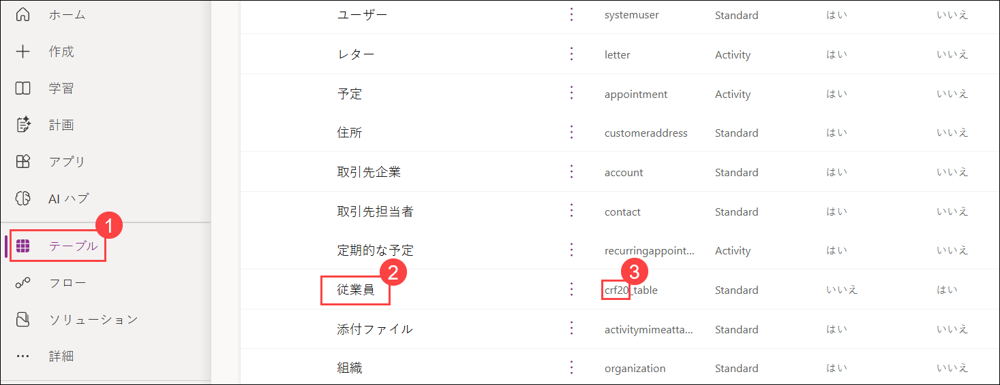

   > **Tip:** **Employee** テーブルが表示されない場合は、**ODL_User <inject key="Deployment ID" enableCopy="false"></inject>'s Environment** に切り替えていることを確認してください。

1. 新しいブラウザー タブを開き、次のリンクを使用して **Microsoft Copilot Studio** に移動します:

   ```
   https://copilotstudio.microsoft.com
   ```

1. **Welcome to Microsoft Copilot Studio** 画面では、デフォルトの **country/region** を維持し、**Get Started** をクリックして続行します。

   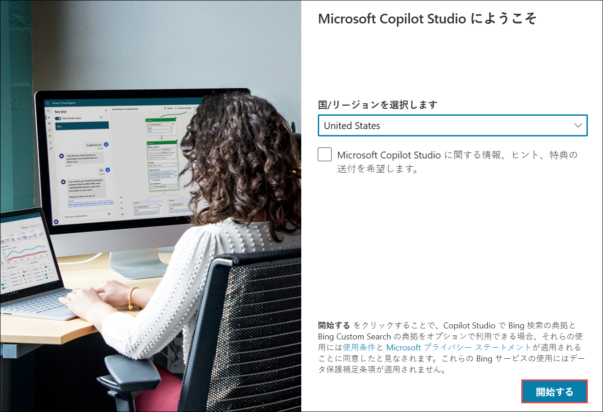

1. **Welcome to Copilot Studio!** ポップアップが表示された場合は、**Skip** をクリックしてメイン ダッシュボードに進みます。

   

1. Copilot Studio で環境ピッカー **(1)** を開き、**Supported environments (2)** を展開し、**ODL_User <inject key="Deployment ID" enableCopy="false"></inject>'s Environment (3)** を選択して切り替えます。

   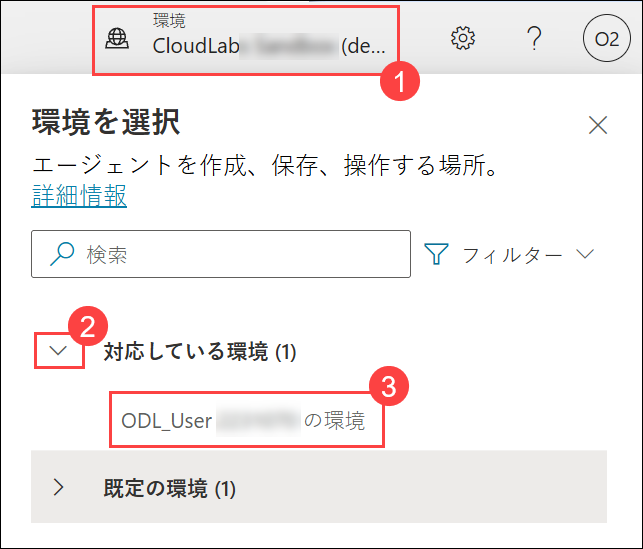

   > **Supported environments** に環境が表示されない場合は、更新するか、再度ログアウトしてログインしてください。

## タスク 2: Safe Travels & Leave Manager エージェントを作成する

このタスクでは、旅行関連のクエリを支援する **Safe Travels Agent** と、従業員の休暇情報を管理し承認する **Leave Manager Agent** の 2 つの AI エージェントを作成します。これにより、異なるビジネス シナリオで複数のエージェントを迅速に構築およびカスタマイズする方法を理解できます。

1. Copilot Studio で **Agents (1)** をクリックし、**Safe Travels (2)** テンプレート カードを選択します。

   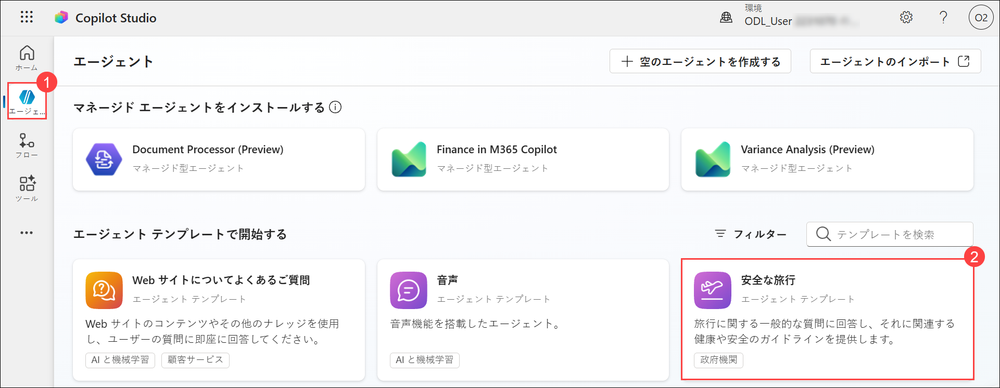

   > **注意:** テンプレートが表示されない場合は、検索ボックスを使用してください。
   
1. 次のペインで **Name (1)** および **Description (2)** フィールドに次の詳細を入力し、**Create (3)** をクリックします。

   | Key | Value |
   |-----|-------|
   | Name | `Safe Travels Agent` |
   | Description | `従業員の旅行計画、ポリシー、およびガイダンスを支援する旅行アシスタント エージェント` |

   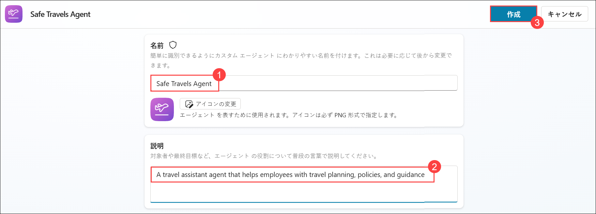

1. **Create** をクリックした後、緑色の成功バナー **"Your agent has been provisioned."** が表示され、**Overview** タブが読み込まれることを確認します。

   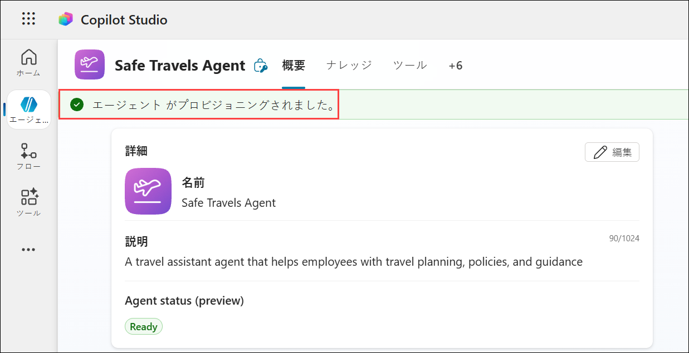

   > **Template Benefits:** Safe Travels は事前構成された旅行フローと知識を提供し、セットアップ時間を短縮します。

1. **Overview (1)** で **+ Add knowledge (2)** をクリックして、内部旅行ポリシー コンテンツの添付を開始します。

   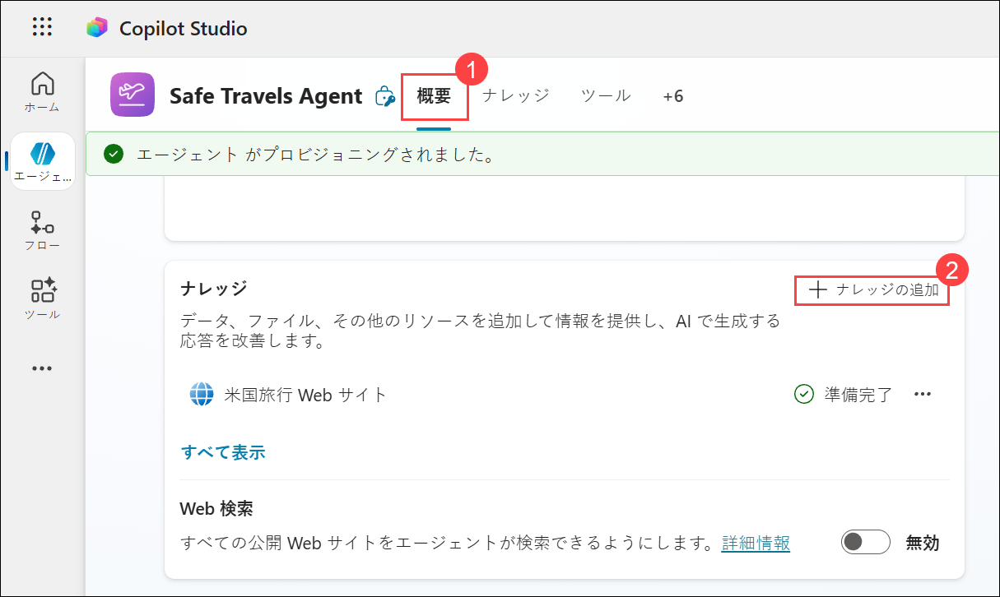

   > **注意:** ナレッジ ソースを追加すると、根拠のある応答が改善されます。ポリシー ファイルを最新の状態に保ってください。

1. **Add knowledge** 画面で **select to browse** をクリックしてナレッジ ファイルをアップロードします。  

   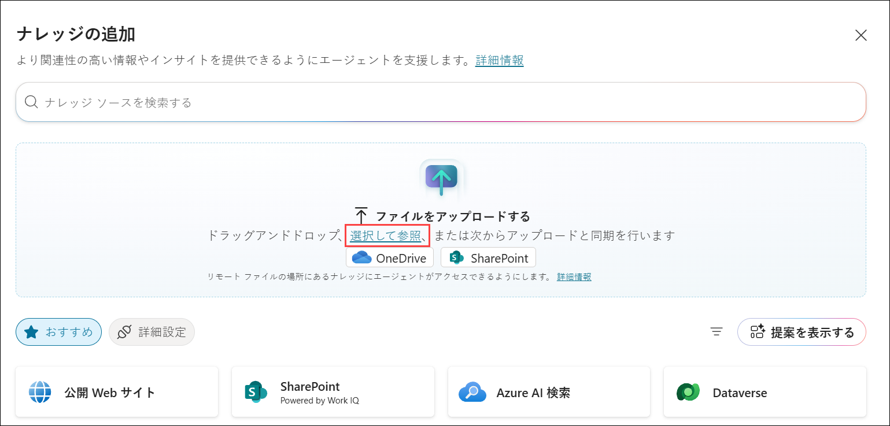

1. ファイル ピッカー ウィンドウでフォルダー **C:\datasets\Safe-Travels-Agent-Automate (1)** に移動し、**Travel Policy (2)** Word 文書ファイルを選択して **Open (3)** をクリックします。

   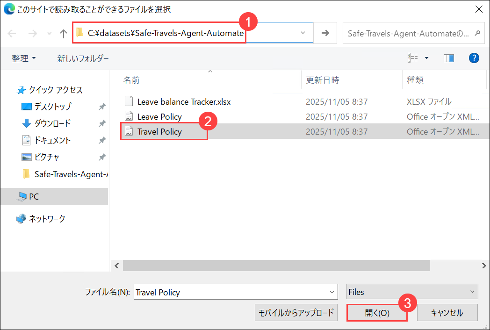

1. ファイルが正常にアップロードされたら、**Add to agent** をクリックしてドキュメントをエージェントのナレッジ ソースとして含めます。

      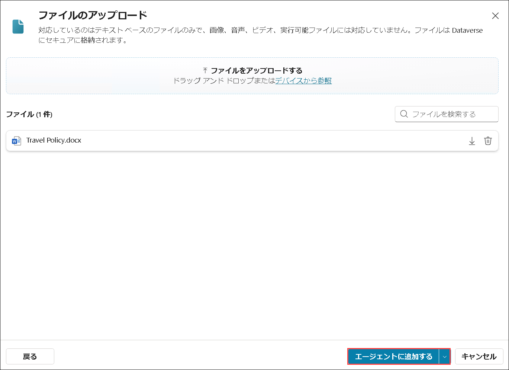

1. システムがエージェント作成を処理します。**プロビジョニングには 10–15 分かかる場合があります。完了するまで次のステップに進んでください**。

   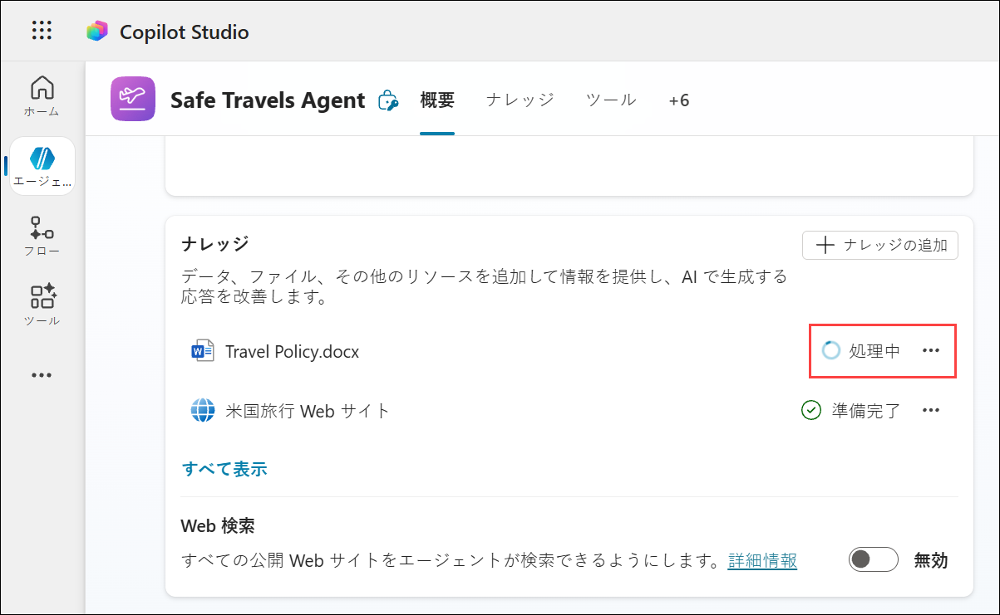

   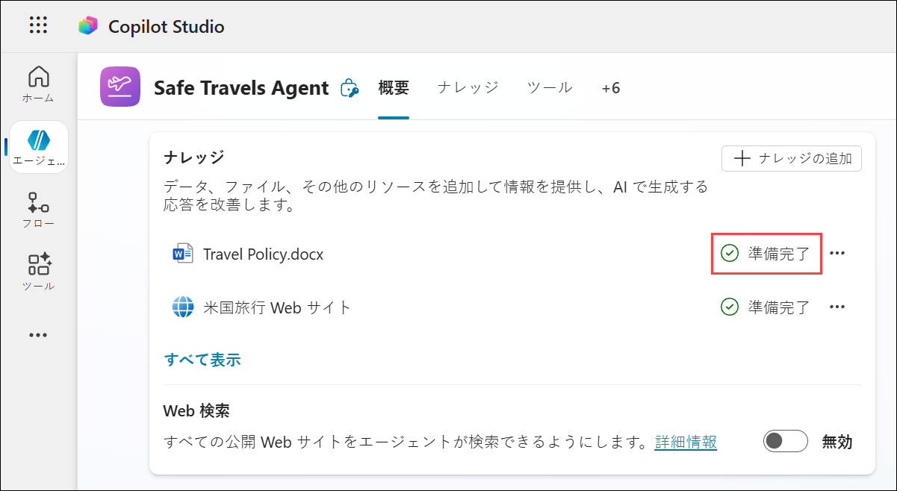

1. **Copilot Studio** に移動し、**Agents (1)** をクリックしてから **+ Create a Blank Agent (2)** を選択して、専門的な Leave Manager エージェントを作成します。

   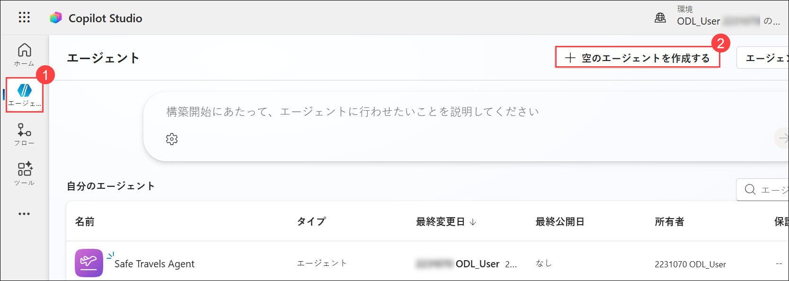

   > **注意:** Copilot Studio UI は時間の経過とともに変更される可能性があります。エージェント名の入力を求められた場合は、次のように入力してください:

   > ```
   > Leave Manager Agent
   > ```

1. エージェントのプロビジョニングが完了するまで待機し、**Edit** をクリックしてエージェントの詳細を設定します。

      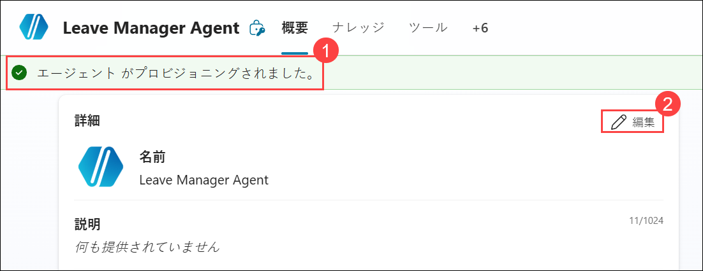

      > **Agent Specialization:** ドメイン固有のエージェントを作成することで、より正確なトレーニングと特定のビジネス機能に関連する応答が可能になります。

1. 次のペインで **Name (1)** および **Description (2)** フィールドに次の詳細を入力し、**Save (3)** を選択します。

   | Key | Value |
   |-----|-------|
   | Name | `Leave Manager Agent` |
   | Description | `すべての従業員の休暇を追跡し、休暇残高と休暇履歴を管理して、新しい休暇リクエストを承認または拒否します。` |

   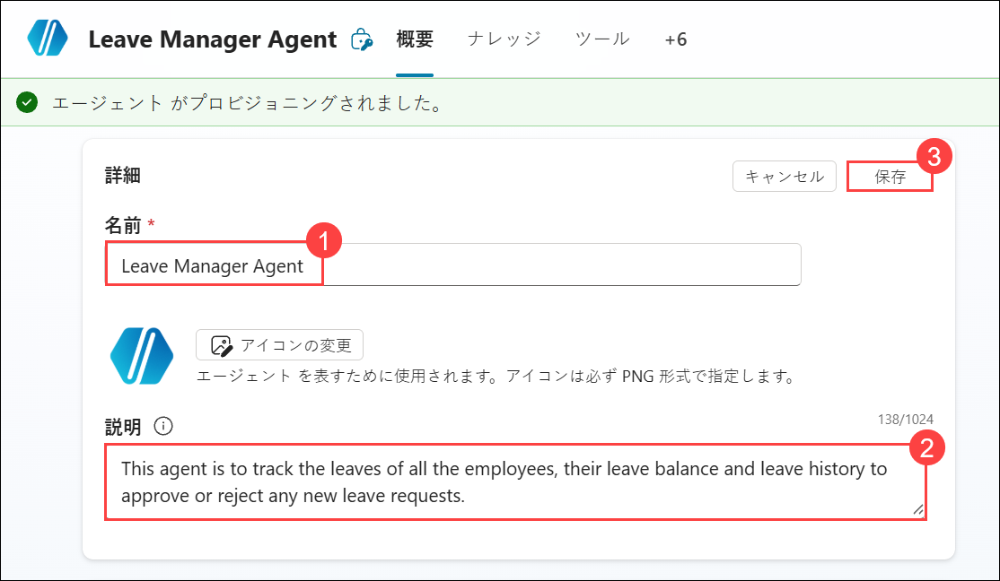

1. 保存したら、下にスクロールして **Instructions** カードの **Edit** をクリックします。

   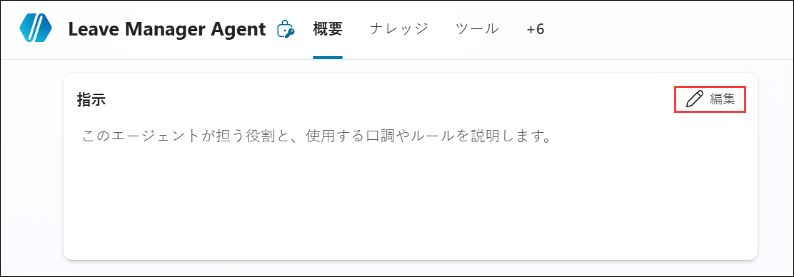

1. 次の指示を設定し、追加したら **Save** をクリックします。

   | Key | Value |
   |-----|-------|
   | Instructions | `従業員の休暇を追跡します。休暇残高を追跡します。残高に基づいて休暇を適用/拒否します。` |

   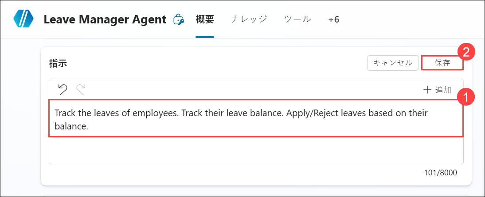

1. **Overview (1)** タブから **Add knowledge (2)** をクリックして、エージェントの休暇管理機能を強化する組織データ ソースを含めます。

   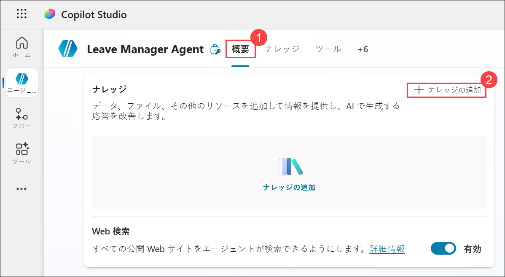

1. **select to browse** をクリックして、エージェントのナレッジ基盤として機能する休暇管理ドキュメントをアップロードします。

   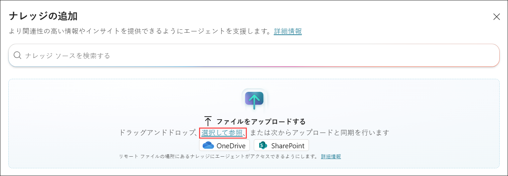

1. ファイル ピッカー ウィンドウでフォルダー **C:\datasets\Safe-Travels-Agent-Automate (1)** に移動し、ファイル **Leave balance Tracker.xlsx (2)** を選択して **Open (3)** をクリックします。

   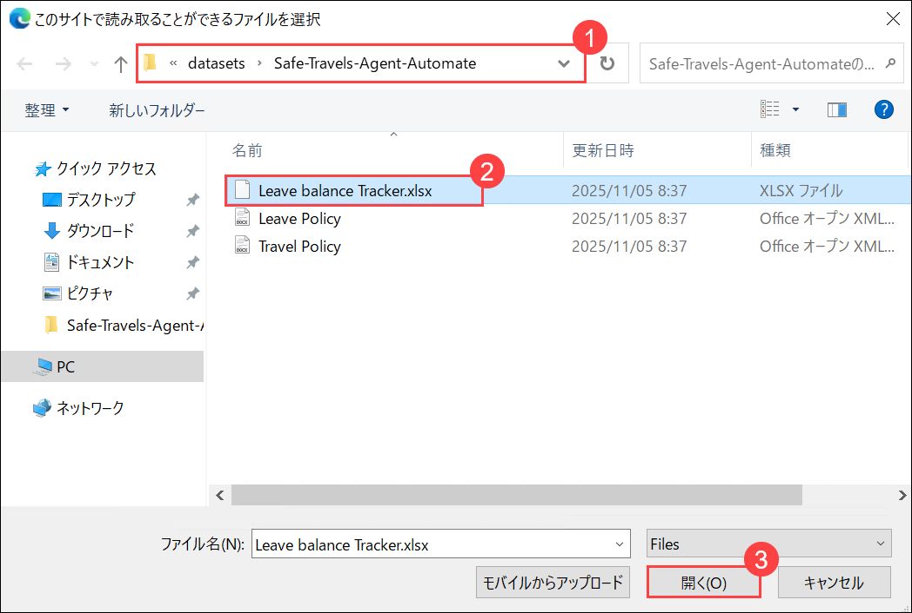

1. 必要な休暇ポリシーおよび追跡ファイルをアップロードし、**Add to agent** をクリックして信頼できるナレッジ ソースとして統合します。

   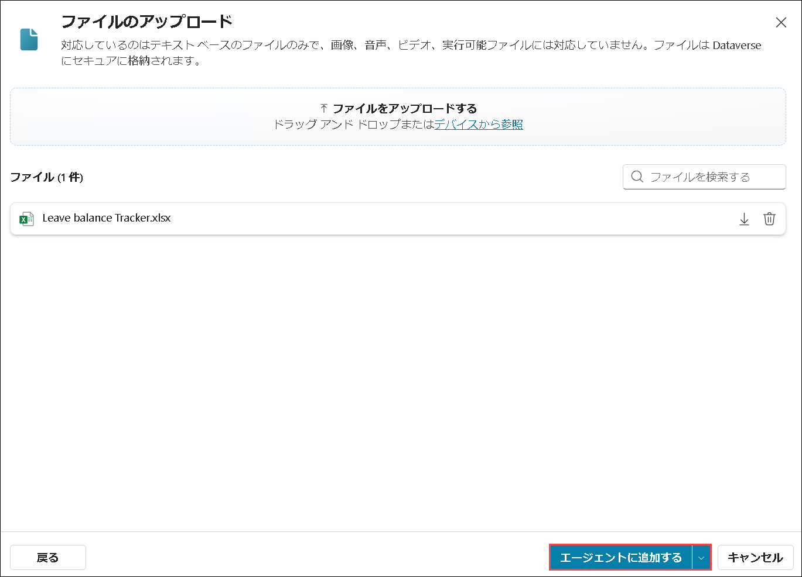

1. アップロードされたすべてのナレッジ ソースが **Ready** ステータスを表示することを確認し、成功した統合とエージェント応答の可用性を確認します。

   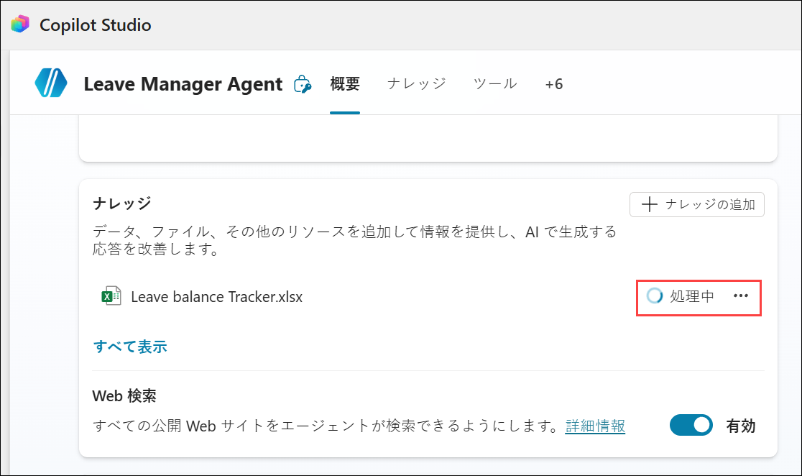

   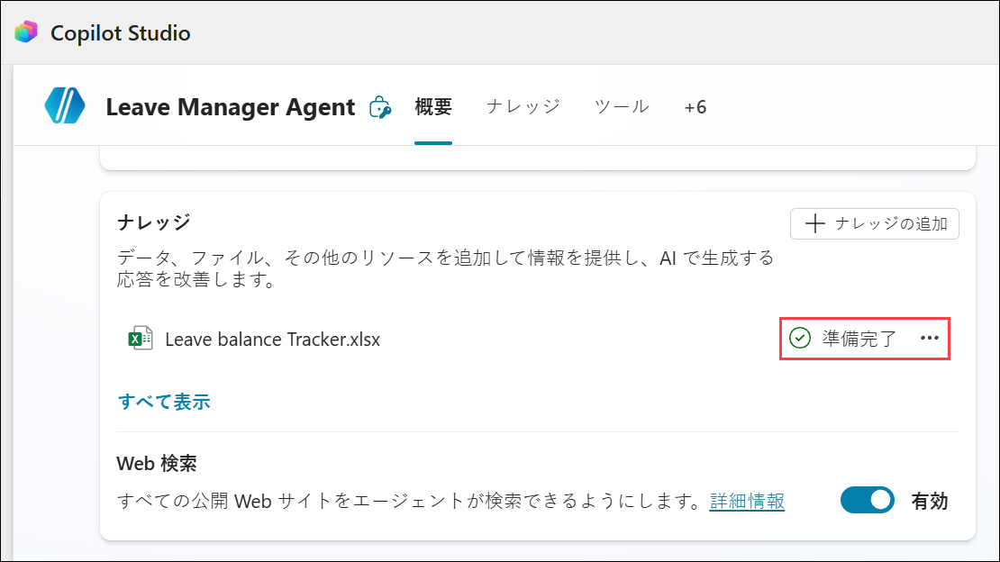

   > **注意:** すべてのナレッジ ソースが **Ready** ステータスを表示するまでに 10–15 分かかる場合があります。処理が完了するまで次のタスクに進むことができます。

   > **Knowledge Integration:** 正常にアップロードされたナレッジ ソースにより、エージェントは組織の実際の休暇管理データに基づいて正確でポリシー準拠の応答を提供できます。

1. 同じ手順に従って **C:\datasets\Safe-Travels-Agent-Automate\Leave Policy** ドキュメントをアップロードしてください。


## タスク 3: エージェントの機能をテストして検証する

このタスクでは、Safe Travels エージェントをテストして、その機能と旅行関連のクエリに対する応答を検証します。

1. 左ナビゲーション メニューから **Agents (1)** をクリックし、一覧から **Safe Travels Agent (2)** を選択して開きます。

   

1. アップロードされたナレッジ ソースが強調表示された **Ready** ステータスを表示することを確認します。

   

   > **注意:** ステータスがまだ **Ready** でない場合は、次のステップに進むことができます。ただし、ナレッジ ソースが完全に処理されるまで、エージェントの応答に最新のデータが反映されない可能性があります。

   > **注意:** 次のタスクに進むことを推奨します。ナレッジ ソースが完全に処理されたら、後で戻ってエージェントを再テストし、改善された正確な応答を確認してください。

1. **Test** をクリックしてテスト パネルを開き、エージェントの応答を検証します。

   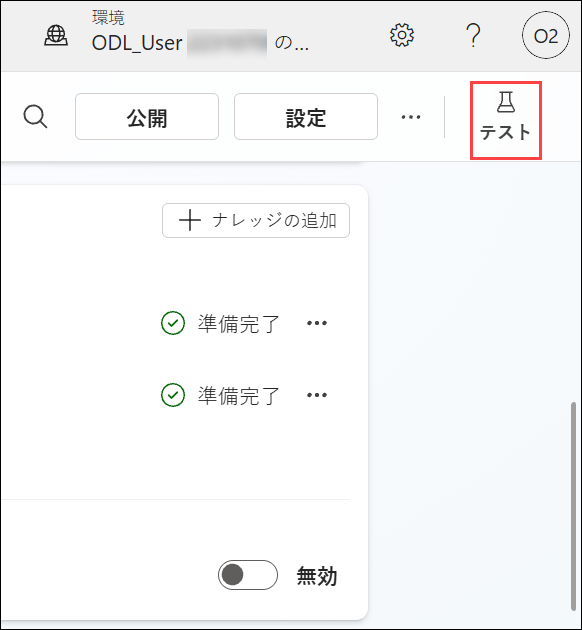

1. テスト チャットで次の **prompt (1)** を入力し、**Send (2)** を選択します。

   ```
   How to apply for passport?
   ```

   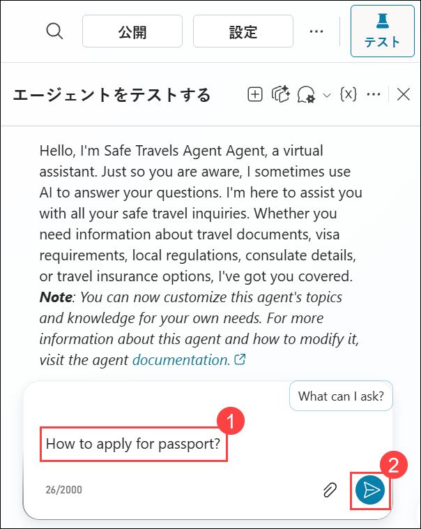

1. エージェントが生成した **response** が期待どおりであることを確認します。
   
   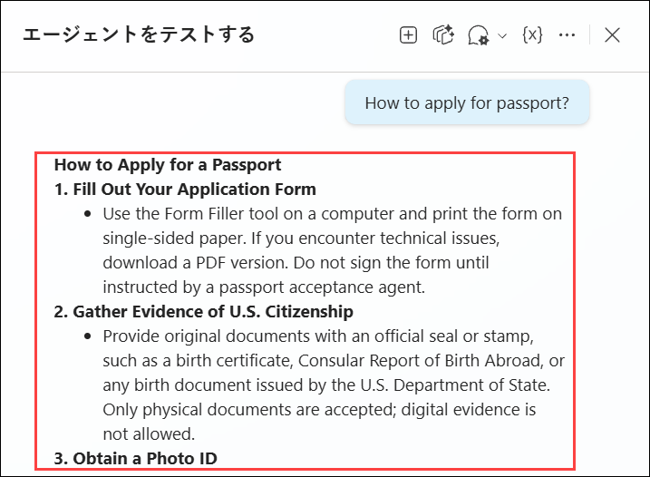

   > **注意:** ナレッジ ソース (Word ファイル) がまだ処理中の場合、出力が異なる可能性があります。これは予想される動作です。ナレッジ ソースが完全に準備されたら、次のタスクでエージェントと再度対話できます。

1. テスト チャットで次の **prompt (1)** を入力し、**Send (2)** を選択します。

   ```
   What is our company travel policy?
   ```

1. エージェントが生成した **response** が期待どおりであることを確認します。

   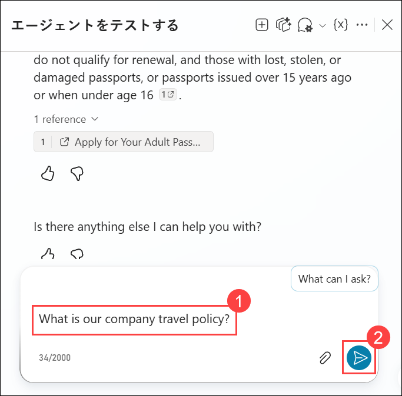
   
1. さまざまな旅行シナリオで追加のテストを続行し、エージェントがさまざまな旅行関連の質問に適切に応答することを確認します。

   > **Knowledge Integration:** エージェントは組み込みの旅行知識を活用して、さまざまな旅行シナリオで役立つ応答を提供します。


## タスク 4: Microsoft Teams にエージェントを公開して展開する

このタスクでは、Safe Travels エージェントを公開し、Microsoft Teams に展開して、組織の従業員がアクセスできるようにします。

1. テスト後、エージェント インターフェイスの右上隅にある **Publish** ボタンをクリックして公開プロセスを開始します。

   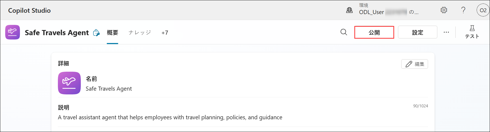

1. 公開ダイアログで公開の詳細を確認し、**Publish** をクリックしてエージェントを公開します。

   

   > **Publishing Process:** エージェントがパッケージ化され、チャネル展開で利用可能になります。このプロセスは少し時間がかかる場合があります。

1. 新しいブラウザー タブを開き、次のリンクを使用して Microsoft Teams に移動します:

   ```
   https://teams.microsoft.com/v2/
   ``` 

1. サインインを求められた場合は、**email address (1)** を入力し、**Next (2)** をクリックします。

   - **Email/Username:** <inject key="AzureAdUserEmail"></inject>

      

1. **Temporary Access Pass (1)** を入力し、**Sign in (2)** をクリックします。

   - **Temporary Access Pass:** <inject key="AzureAdUserPassword"></inject>

      

1. "Get to know Teams" ウェルカム画面が表示された場合は、**Get Started** をクリックして続行します。

   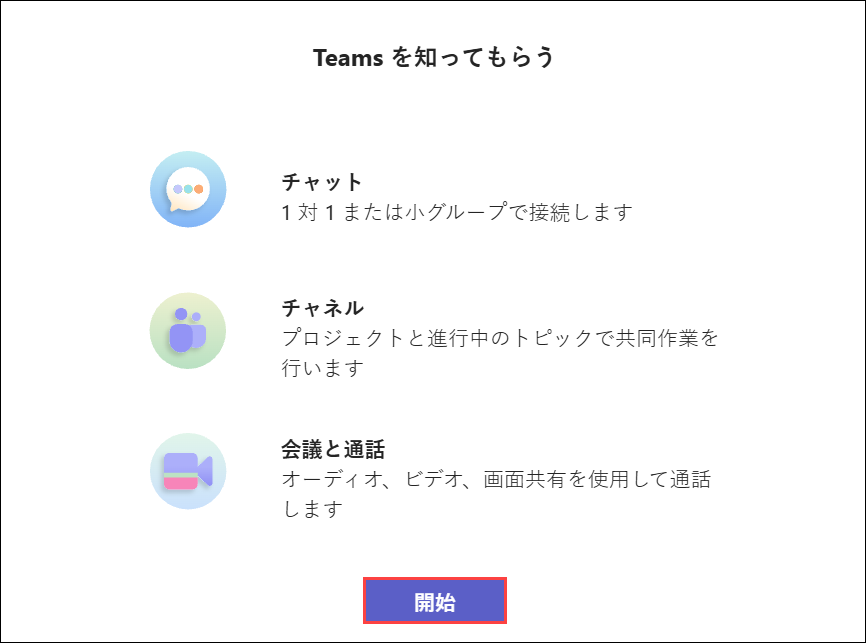

1. 公開が正常に完了したら、**Channels** セクションに移動してエージェントの展開チャネルを設定します。

   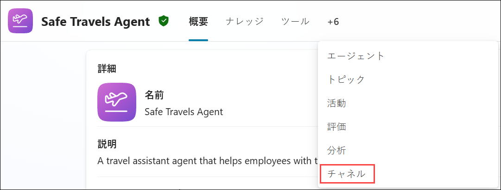

1. Channels インターフェイスで利用可能な展開オプションが表示されます。**Microsoft Teams** を選択してエージェントを Teams に展開します。

   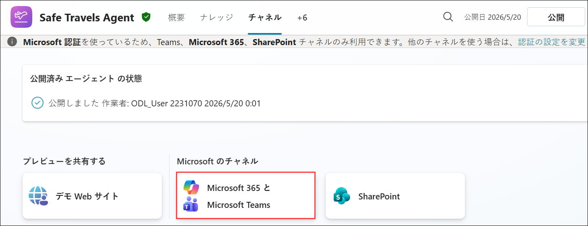

   > **Channel Benefits:** Microsoft Teams に展開することで、ユーザーは使い慣れたコラボレーション環境を通じてアクセスでき、採用と使用が向上します。

1. **Teams and Microsoft 365 Copilot** ウィンドウでチェックボックス **Make agent available in Microsoft 365 Copilot (1)** を選択し、**Add channel (2)** をクリックします。

   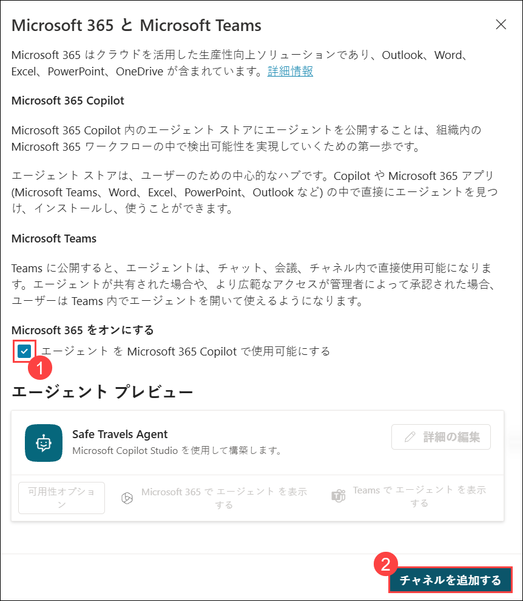

1. チャネルが正常に追加されたら、公開ダイアログが表示されます。**Publish** をクリックしてください。

   

1. 公開されたら、**See agent in Teams** オプションを選択して Teams にエージェントを追加します。

   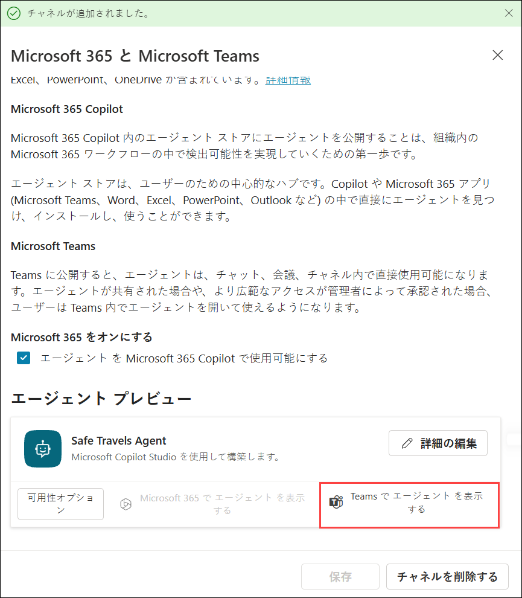

1. Teams デスクトップ アプリのダウンロードを求められた場合は、**Use the web app instead** をクリックしてブラウザーで Teams を続行します。

   

1. Safe Travels Agent ダイアログでエージェント情報を確認し、**Add** をクリックして Teams 環境にエージェントをインストールします。

   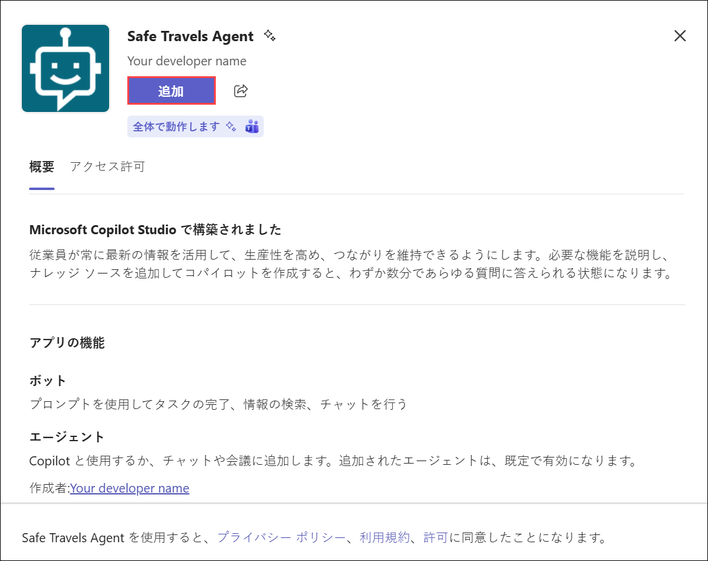

1. インストールが正常に完了したら、確認メッセージが表示されます。**Open** をクリックして Safe Travels Agent をすぐに使用を開始します。

   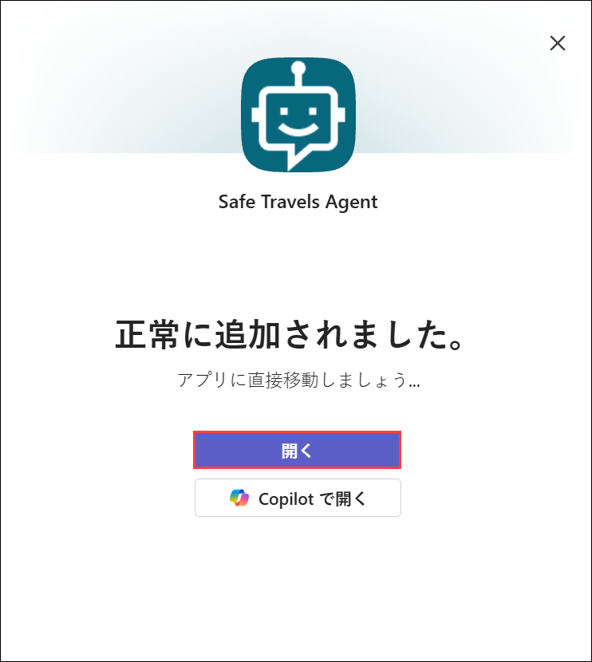

1. Safe Travels Agent チャット インターフェイスが開きます。テキスト ボックス (1) に最初のメッセージを入力し、**Send** ボタン (2) をクリックしてエージェントをテストします。

   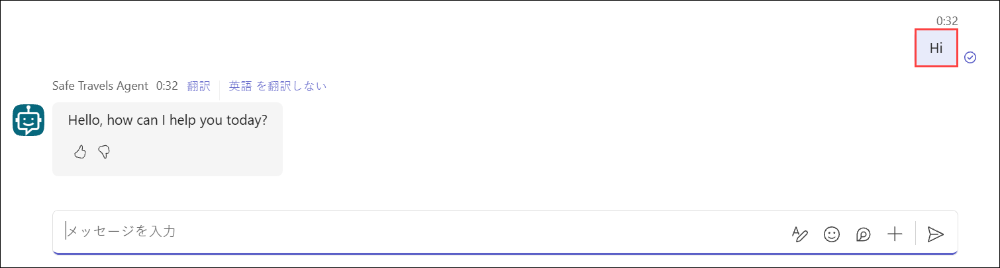

1. **Safe Travels Agent** チャット インターフェイスが開きます。テキスト ボックス **(1)** に最初のメッセージを入力し、**Send** ボタン **(2)** をクリックします。

   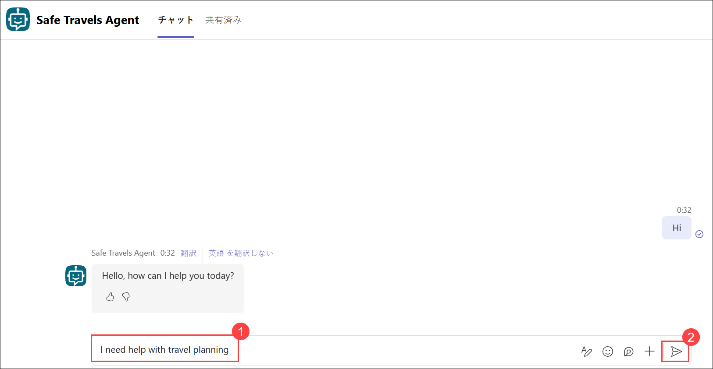

1. エージェントとの対話を開始します。旅行関連の質問をいくつか尋ね、エージェントの応答を確認します。

<validation step="93a6c432-2df0-4b2a-bea2-658266d0ac58" />
 
> **おめでとうございます!** タスクが完了しました。次に検証します。手順は以下の通りです:
> - 対応するタスクの Validate ボタンをクリックします。成功メッセージが表示されたら、次のタスクに進んでください。 
> - 表示されない場合は、エラー メッセージを注意深く読み、ラボ ガイドの手順に従ってステップを再試行してください。
> - サポートが必要な場合は、cloudlabs-support@spektrasystems.com までお問い合わせください。24/7 でお手伝いします。

## まとめ

正常に完了しました:

- データ テーブルをインポートし、Copilot Studio に移動しました
- Microsoft のテンプレートを使用して動作する Safe Travels エージェントを作成しました
- エージェントの旅行支援機能を実際のクエリでテストしました
- エージェントを公開し、組織の Microsoft Teams に展開しました

Safe Travels エージェントは現在ライブで、従業員の旅行質問、パスポート情報、目的地ガイダンスを支援する準備ができています。プログラミングなしでエンタープライズ対応の会話型 AI エージェントを作成するローコード AI 開発の力を体験しました。

### 演習 1 を正常に完了しました。**Next >>** をクリックして演習 2 に進んでください。

