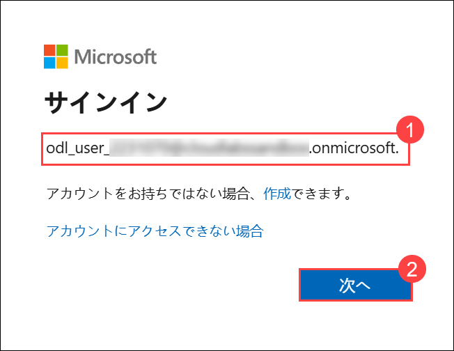
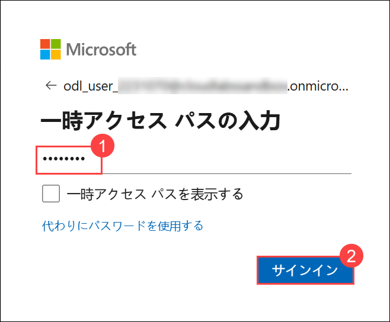

# 演習 1: Safe Travels エージェントの作成と Microsoft Teams への展開

### 推定所要時間: 30 分

## 概要

この基礎演習では、Microsoft Copilot Studio の Safe Travels テンプレートを使用して最初の AI エージェントを作成します。会話型 AI への実践的な入門として、Microsoft Teams に展開された出張支援エージェントを完成させます。

Safe Travels エージェントは、出張関連の質問、ポリシー情報、およびガイダンスで従業員をサポートします。テンプレートを使用して強力な AI エージェントを作成し、十分にテストして組織のコラボレーション プラットフォームに展開することがいかに簡単かを体験できます。この演習は、あらゆるビジネス シナリオに応用できるエージェント開発のコア ワークフローに慣れることを目的としています。

## 目標

以下のタスクを完了します。

- タスク 1: データ テーブルのインポートと Copilot Studio への移動
- タスク 2: テンプレートから Safe Travels エージェントを作成
- タスク 3: エージェントの機能をテストおよび検証
- タスク 4: エージェントを公開して Microsoft Teams に展開

## タスク 1: データ テーブルのインポートと Copilot Studio への移動

このタスクでは、必要なデータ テーブルを Power Platform 環境にインポートし、Copilot Studio に移動してエージェントの構築を開始します。

1. Power Apps ポータルに戻り、先ほど作成した環境に切り替えてください。

   

1. 完了したら、左メニューから **[テーブル (1)]** を選択し、**[Excel または .CSV ファイルで作成 (2)]** をクリックします。

   

   > **注:** 権限がないというメッセージが表示された場合は、**[切り替えて作成]** をクリックしてください。

   

   > **注:** **[Excel ファイルのアップロード]** 画面に直接移動した場合は、**[キャンセル]** をクリックして戻ってください。

   

1. 次のウィンドウで **[デバイスから選択]** をクリックし、ポップアップ ウィンドウでファイルを選択します。

   

1. ファイル ピッカー ダイアログで以下の操作を行います。
   - **`C:\datasets\Safe-Travels-Agent-Automate`(1)** に移動します。
   - **Leave balance Tracker.xlsx (2)** を選択します。
   - **[開く (3)]** をクリックしてファイルを追加します。

      

1. **[Excel または .CSV ファイルのインポート]** ウィンドウで、テーブルが含まれていることを確認し、**[インポート]** をクリックします。

   

1. テーブル マッピング画面で **[保存して終了]** をクリックします。

   

1. **[作業を終了しますか?]** ダイアログで、**[保存して終了]** をクリックします。

   

1. プロビジョニングが完了したら、**[テーブル (1)]** を開いて **[Employee (2)]** テーブルが一覧に表示されていることを確認します。論理**プレフィックス (3)** も確認してください。このプレフィックスはテーブルを一意に識別するもので、今後の自動化に使用されます (このラボではこれ以上は使用しません)。

   

   > **ヒント:** **Employee** テーブルが表示されない場合は、**ODL_User <inject key="Deployment ID" enableCopy="false"></inject> の環境**に切り替えていることを確認してください。

1. 新しいブラウザー タブを開き、以下のリンクを使用して **Microsoft Copilot Studio** に移動します。

   ```
   https://copilotstudio.microsoft.com
   ```

1. **[Microsoft Copilot Studio へようこそ]** 画面で、既定の**国/地域**の選択のまま **[はじめる]** をクリックして続行します。

   

1. **[Copilot Studio へようこそ!]** ポップアップが表示された場合は、**[スキップ]** をクリックしてメイン ダッシュボードに進みます。

   

1. Copilot Studio で、環境ピッカー **(1)** を開き、**[サポートされている環境 (2)]** を展開して、**[ODL_User <inject key="Deployment ID" enableCopy="false"></inject> の環境 (3)]** を選択して切り替えます。

   

   > **[サポートされている環境]** に環境が表示されない場合は、ページを更新するか、一度サインアウトしてから再度サインインしてください。

## タスク 2: Safe Travels エージェントと Leave Manager エージェントの作成

このタスクでは、出張関連の照会に対応する **Safe Travels エージェント**と、従業員の休暇情報および承認を管理する **Leave Manager エージェント**の 2 つの AI エージェントを作成します。複数のエージェントをさまざまなビジネス シナリオ向けに素早く構築およびカスタマイズする方法を理解するのに役立ちます。

1. Copilot Studio で **[エージェント (1)]** をクリックし、**[Safe Travels (2)]** テンプレート カードを選択します。

   

   > **注:** テンプレートが表示されない場合は、検索ボックスを使用してください。
   
1. 次のウィンドウで、**[名前 (1)]** フィールドと **[説明 (2)]** フィールドに以下の詳細を入力し、**[作成 (3)]** をクリックします。

   | 項目 | 値 |
   |-----|-------|
   | Name | `Safe Travels Agent` |
   | Description | `A travel assistant agent that helps employees with travel planning, policies, and guidance` |

   

1. **[作成]** をクリックした後、緑色の成功バナー **「エージェントがプロビジョニングされました。」** が表示され、**[概要]** タブが読み込まれることを確認します。

   

   > **テンプレートのメリット:** Safe Travels には出張フローとナレッジが事前設定されており、セットアップ時間を短縮できます。

1. **[概要 (1)]** で **[+ ナレッジの追加 (2)]** をクリックして、内部の出張ポリシー コンテンツの添付を開始します。

   

   > **注:** ナレッジ ソースを追加することで、根拠のある応答が向上します。精度を維持するためにポリシー ファイルを最新の状態に保つようにしてください。

1. **[ナレッジの追加]** 画面で、**[参照して選択]** をクリックしてナレッジ ファイルをアップロードします。

   

1. ファイル ピッカー ウィンドウで、**C:\datasets\Safe-Travels-Agent-Automate (1)** フォルダーに移動し、**Travel Policy (2)** Word ドキュメント ファイルを選択して、**[開く (3)]** をクリックします。

   

1. ファイルが正常にアップロードされたら、**[エージェントに追加]** をクリックして、このドキュメントをエージェントのナレッジ ソースとして含めます。

      

1. システムがエージェントの作成を処理します。**プロビジョニングには 10 ～ 15 分かかる場合があります。完了するまでの間、次の手順に進んでください。**

   

   

1. **Copilot Studio** に移動し、**[エージェント (1)]** をクリックして、**[+ 空のエージェントを作成 (2)]** を選択して専門化された Leave Manager エージェントを作成します。

   

   > **注:** Copilot Studio の UI は変更される場合があります。エージェント名の入力を求められた場合は、次のように入力してください。

   > ```
   > Leave Manager Agent
   > ```

1. エージェントのプロビジョニングが完了するまで待ち、**[編集]** をクリックしてエージェントの詳細を設定します。

      

      > **エージェントの専門化:** ドメイン固有のエージェントを作成することで、特定のビジネス機能に対して精度が向上し、より関連性の高い応答が得られます。

1. 次のウィンドウで、**[名前 (1)]** フィールドと **[説明 (2)]** フィールドに以下の詳細を入力し、**[保存 (3)]** を選択します。

   | 項目 | 値 |
   |-----|-------|
   | Name | `Leave Manager Agent` |
   | Description | `This agent is to track the leaves of all the employees, their leave balance and leave history to approve or reject any new leave requests.` |

   

1. 保存したら、下にスクロールして **[指示]** カードの **[編集]** をクリックします。

   

1. 以下の指示を設定し、追加後に **[保存]** をクリックします。

   | 項目 | 値 |
   |-----|-------|
   | Instructions | `Track the leaves of employees. Track their leave balance. Apply/Reject leaves based on their balance.` |

   

1. **[概要 (1)]** タブで **[ナレッジの追加 (2)]** をクリックして、エージェントの休暇管理機能を強化する組織データ ソースを含めます。

   

1. **[参照して選択]** をクリックして、エージェントのナレッジの基盤となる休暇管理ドキュメントをアップロードします。

   

1. ファイル ピッカー ウィンドウで、**C:\datasets\Safe-Travels-Agent-Automate (1)** フォルダーに移動し、**Leave balance Tracker.xlsx (2)** ファイルを選択して、**[開く (3)]** をクリックします。

   

1. 必要な休暇ポリシーおよびトラッキング ファイルをアップロードしたら、**[エージェントに追加]** をクリックして、権威あるナレッジ ソースとして統合します。

   

1. アップロードされたすべてのナレッジ ソースが**準備完了**ステータスを表示していることを確認し、正常に統合されてエージェントの応答に利用可能であることを確認します。

   

   

   > **注:** すべてのナレッジ ソースが**準備完了**ステータスになるまで 10 ～ 15 分かかる場合があります。処理が完了するまでの間、次のタスクに進んでいただいて構いません。

   > **ナレッジの統合:** アップロードされたナレッジ ソースにより、エージェントは組織の実際の休暇管理データに基づいた正確でポリシーに準拠した応答を提供できます。

1. 同じ手順に従い、**C:\datasets\Safe-Travels-Agent-Automate\Leave Policy** ドキュメントをアップロードしてください。

## タスク 3: エージェントの機能のテストと検証

このタスクでは、Safe Travels エージェントをテストして、機能と出張関連の照会に対する応答を検証します。

1. 左側のナビゲーション メニューから **[エージェント (1)]** をクリックし、一覧から **[Safe Travels Agent (2)]** を選択して開きます。

   

1. アップロードされたナレッジ ソースがハイライトされているように**準備完了**ステータスを表示していることを確認します。

   

   > **注:** ステータスがまだ**準備完了**でない場合でも、次の手順に進むことができます。ただし、ナレッジ ソースが完全に処理されるまで、エージェントの応答は最新データを反映していない場合があります。

   > **注:** 次のタスクに進んで作業することをお勧めします。ナレッジ ソースが完全に処理されたら、後で戻ってエージェントを再テストすることで、より改善された正確な応答を確認できます。

1. **[テスト]** をクリックしてテスト パネルを開き、エージェントの応答を確認します。

   

1. テスト チャットで次の**プロンプト (1)** を入力し、**[送信 (2)]** を選択します。

   ```
   How to apply for passport?
   ```

   

1. エージェントによって生成された**応答**が期待通りであることを確認します。
   
   

   > **注:** ナレッジ ソース (Word ファイル) がまだ処理中の場合、出力が異なる場合があります。これは想定された動作です。次のタスクに進んでいただいて構いません。ナレッジ ソースが完全に準備できたら、今後のタスクで再度エージェントと対話します。

1. テスト チャットで次の**プロンプト (1)** を入力し、**[送信 (2)]** を選択します。

   ```
   What is our company travel policy?
   ```

1. エージェントによって生成された**応答**が期待通りであることを確認します。

   
   
1. さらに出張シナリオでテストを続け、エージェントがさまざまな出張関連の質問に適切に応答することを確認します。

   > **ナレッジの統合:** エージェントは組み込みの出張ナレッジを活用して、さまざまな出張シナリオに対して役立つ応答を提供します。

## タスク 4: エージェントの公開と Microsoft Teams への展開

このタスクでは、Safe Travels エージェントを公開して Microsoft Teams に展開し、組織の従業員がアクセスできるようにします。

1. テスト後、エージェント インターフェースの右上隅にある **[公開]** ボタンをクリックして、公開プロセスを開始します。

   

1. 公開ダイアログで、公開の詳細を確認し、**[公開]** をクリックして確定します。

   

   > **公開プロセス:** エージェントはパッケージ化されてチャネルの展開に利用可能になります。このプロセスには少し時間がかかる場合があります。

1. 新しいブラウザー タブを開き、以下のリンクを使用して Microsoft Teams に移動します。

   ```
   https://teams.microsoft.com/v2/
   ``` 

1. サインインを求められた場合は、**メール アドレス (1)** を入力し、**[次へ (2)]** をクリックします。

   - **メール アドレス/ユーザー名:** <inject key="AzureAdUserEmail"></inject>

      

1. **一時アクセス パス (1)** を入力し、**[サインイン (2)]** をクリックします。

   - **一時アクセス パス:** <inject key="AzureAdUserPassword"></inject>

      

1. 「Teams の使い方を学ぶ」ようこそ画面が表示された場合は、**[はじめる]** をクリックして続行します。

   

1. 公開が完了したら、**[チャネル]** セクションに移動してエージェントの展開チャネルを設定します。

   

1. チャネル インターフェースに利用可能な展開オプションが表示されます。**[Microsoft Teams]** を選択してエージェントを Teams に展開します。

   

   > **チャネルのメリット:** Microsoft Teams に展開することで、ユーザーは使い慣れたコラボレーション環境からアクセスできるようになり、導入と利用が促進されます。

1. **[Teams および Microsoft 365 Copilot]** ウィンドウで、**[Microsoft 365 Copilot でエージェントを利用可能にする (1)]** チェックボックスを選択し、**[チャネルの追加 (2)]** をクリックします。

   

1. チャネルが正常に追加されると、公開を確認するダイアログが表示されます。**[公開]** をクリックしてください。

   

1. 公開が完了したら、**[Teams でエージェントを表示]** オプションを選択して、Teams にエージェントを追加します。

   

1. Teams デスクトップ アプリのダウンロードを促すメッセージが表示された場合は、**[代わりに Web アプリを使用する]** をクリックしてブラウザーで Teams を引き続き使用します。

   

1. Safe Travels Agent ダイアログでエージェント情報を確認し、**[追加]** をクリックして Teams 環境にエージェントをインストールします。

   

1. インストールが正常に完了すると、確認メッセージが表示されます。**[開く]** をクリックして Safe Travels Agent をすぐに使い始めましょう。

   

1. **Safe Travels Agent** のチャット インターフェースが開きます。テキスト ボックス **(1)** にメッセージを入力し、**[送信]** ボタン **(2)** をクリックします。

   

1. エージェントとの対話を開始します。いくつかの出張関連の質問をして、エージェントの応答を確認してください。

<validation step="93a6c432-2df0-4b2a-bea2-658266d0ac58" />
 
> **タスクの完了、おめでとうございます!** 次は検証を行いましょう。以下の手順に従ってください。
> - 該当するタスクの [検証] ボタンをクリックしてください。成功メッセージが表示されたら、次のタスクに進むことができます。
> - 表示されない場合は、エラー メッセージをよく読んで手順を再確認し、ラボ ガイドの指示に従って再試行してください。
> - サポートが必要な場合は、cloudlabs-support@spektrasystems.com までお問い合わせください。24 時間 365 日対応しています。

## まとめ

以下のことを正常に完了しました。

- データ テーブルをインポートし、Copilot Studio に移動しました。
- Microsoft のテンプレートを使用して動作する Safe Travels エージェントを作成しました。
- 実際の照会でエージェントの出張支援機能をテストしました。
- エージェントを公開して Microsoft Teams に展開し、組織で利用できるようにしました。

Safe Travels エージェントが稼働し、従業員の出張に関する質問、パスポート情報、および目的地のガイダンスをサポートする準備ができました。プログラミングなしでエンタープライズ対応の会話型エージェントを作成するローコード AI 開発の力を体験しました。

### 演習 1 が正常に完了しました。**[次へ >>]** をクリックして演習 2 に進んでください。
