# 演習 2: エージェント フローとマルチエージェント オーケストレーション

### 推定所要時間: 30 分

## 概要

この演習では、Safe Travels エージェントをビジネス プロセスの自動化で強化し、マルチエージェント オーケストレーション機能を体験します。Microsoft Teams と統合した包括的な出張承認ワークフローを作成し、既存の出張支援エージェントとシームレスに連携する専門化された Leave Manager エージェントを構築します。

この演習では、会話型 AI が実際のビジネス シナリオでいかに強力かを示します。エージェントが実際のビジネス プロセスをトリガーし、互いに連携し、エンドツーエンドの自動化ソリューションを提供する様子を確認できます。演習の終わりには、Safe Travels エージェントが休暇関連の照会を専門化された Leave Manager エージェントに自動的にルーティングしながら、自動化された Teams 通知を通じて出張承認を処理する高度なマルチエージェント システムが完成します。

## 目標

以下のタスクを完了します。

- タスク 1: Teams ワークスペースの設定とエージェント フロー トリガーの初期化
- タスク 2: フロー アクションの設定と Teams メッセージの投稿
- タスク 3: 出張承認フローをエージェントに統合してエンドツーエンドでテスト
- タスク 4: Leave Manager エージェントの構築とマルチエージェント オーケストレーションの確立

## タスク 1: Teams ワークスペースの設定とエージェント フロー トリガーの初期化

このタスクでは、出張承認ワークフローの基盤を構築します。Teams ワークスペースを作成し、必要な入力でエージェント フロー トリガーを初期化します。これにより、後の自動化と統合のための準備が整います。

1. **Microsoft Teams** に移動し、**[チャット (1)]** セクションに移動して、**[新規 (2)]** ドロップダウンをクリックし、**[新しいチーム (3)]** を選択して出張承認専用のワークスペースを作成します。

   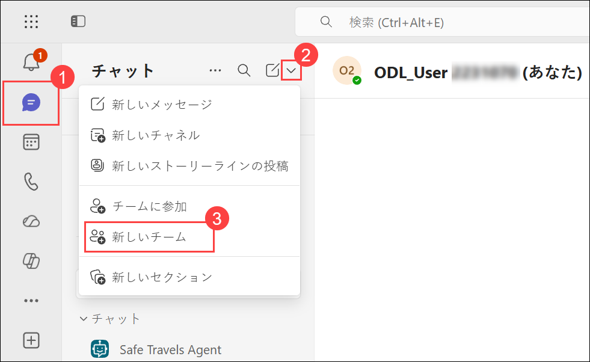

   >**Teams 統合の基盤:** 専用のチームとチャネル構造を作成することで、出張承認リクエストが整理され、レビューと処理のために適切な関係者にルーティングされます。

1. 新しいチームに以下の詳細を設定し、**[作成 (3)]** をクリックします。

   | 項目 | 値 |
   |-----|-------|
   | Team name **(1)** | `HR Team` |
   | First channel **(2)** | `Travel Approvals` |

   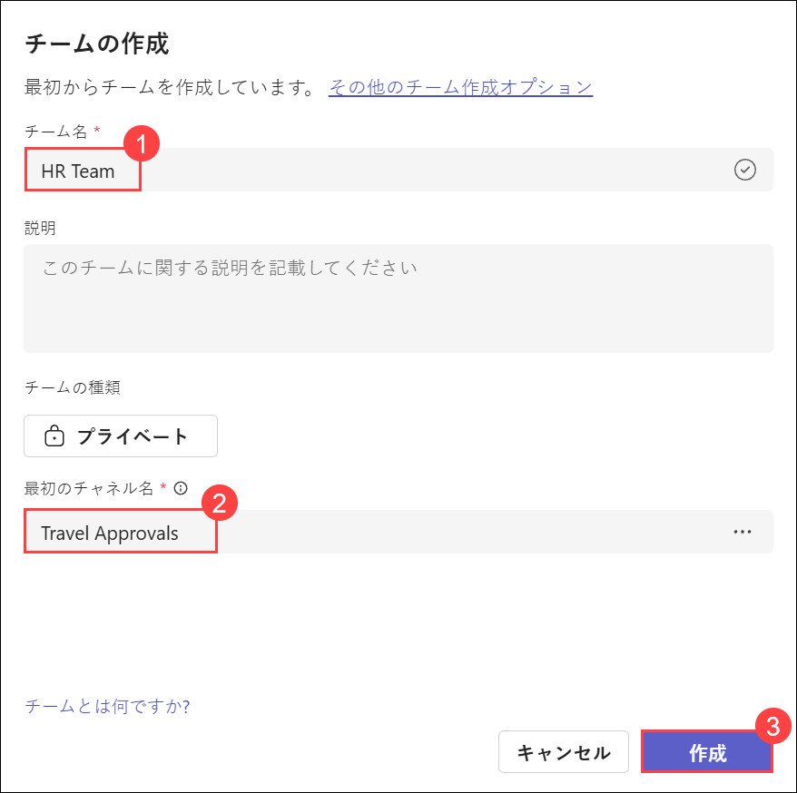

1. **[HR Team にメンバーを追加]** ウィンドウで、このデモではメンバーを追加せずに **[スキップ]** を選択して続行します。

   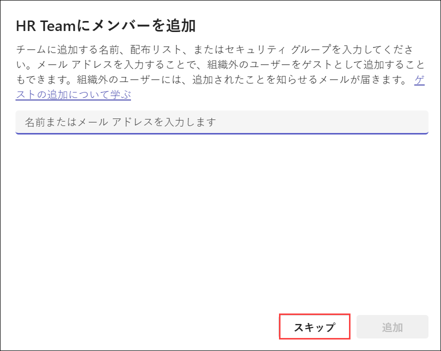

1. **Copilot Studio** に戻り、左メニューから **[フロー (1)]** を選択して、**[新しいエージェント フロー (2)]** をクリックして新しい自動化ワークフローを作成します。

   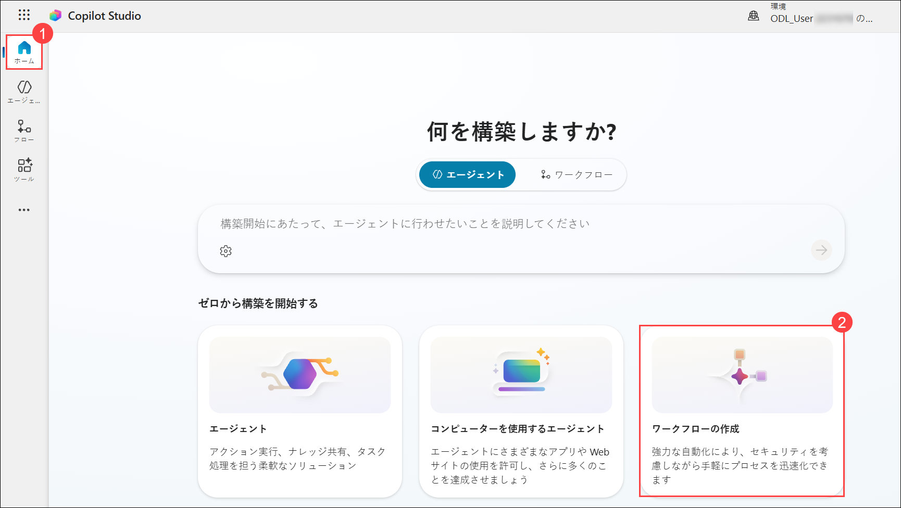

1. **[トリガーの追加]** ウィンドウで、**[スキル (1)]** を検索し、**[エージェントがフローを呼び出したとき (2)]** を選択します。

   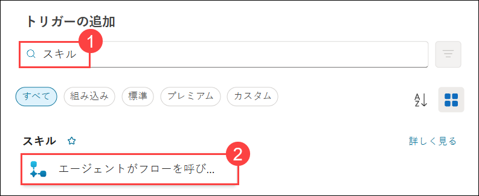

   > **ワークフローの基盤:** このトリガーにより、エージェントがユーザーとの会話に基づいてビジネス プロセスを自動的に開始できるようになり、会話型 AI とビジネス オペレーションのシームレスな統合が実現します。

1. トリガー ノードの下の **[入力の追加]** をクリックして、エージェントがワークフローに渡すデータ パラメーターを定義します。

   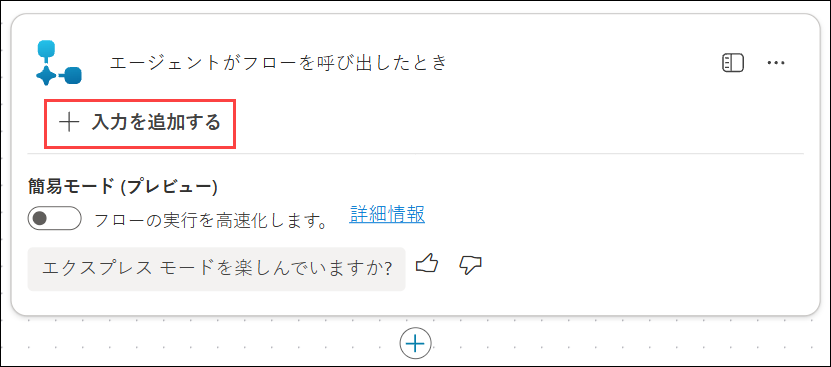

1. 最初の入力パラメーターのデータ型として **[数値]** を選択して、従業員 ID を取得します。

   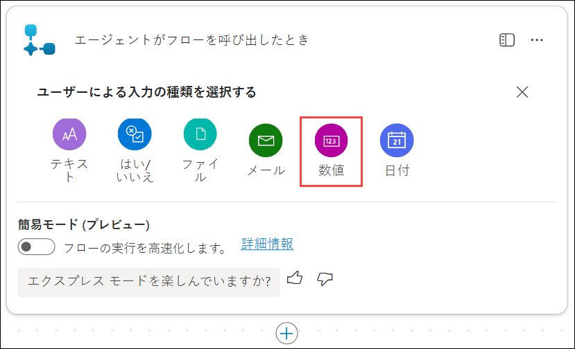

1. 最初の入力パラメーターを設定します。
   - **名前:** **Employee ID (1)** を入力します。
   - **[入力の追加 (2)]** をクリックして 2 番目のパラメーターを作成します。

      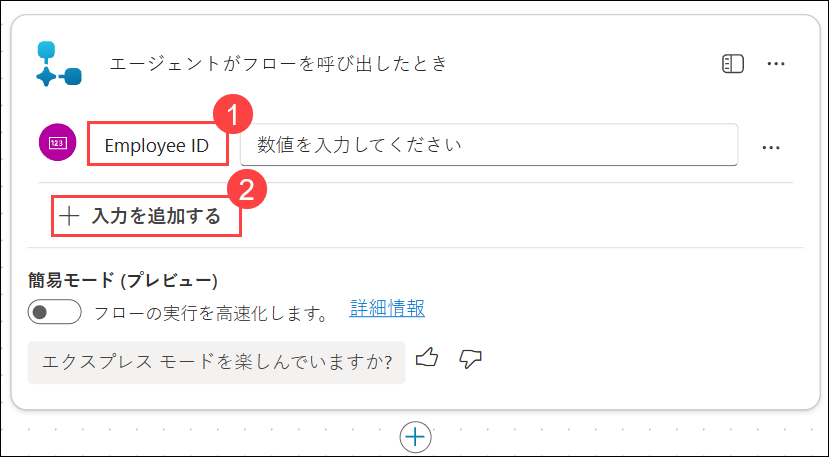

1. 2 番目の入力パラメーターのデータ型として **[テキスト]** を選択して、出張の詳細を取得します。

   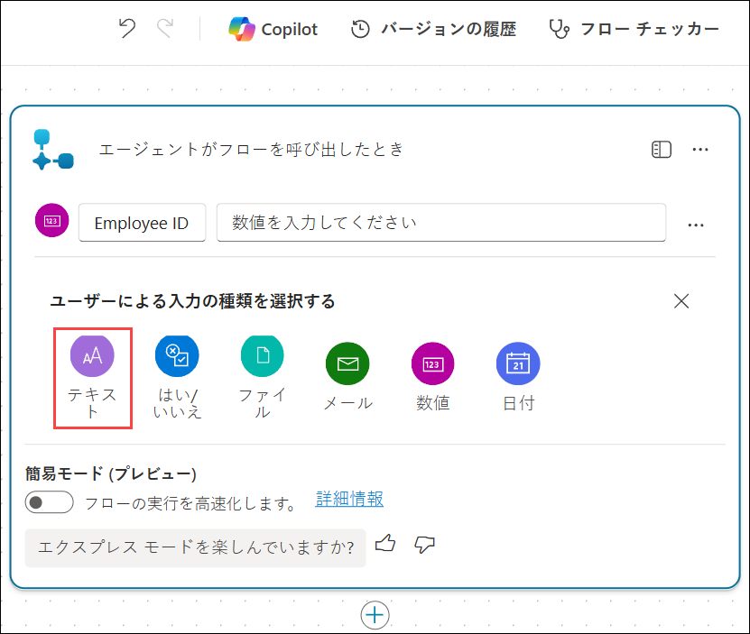

1. 2 番目の入力パラメーターに **Purpose** という名前を付けて、出張リクエストのビジネス上の理由を取得します。

   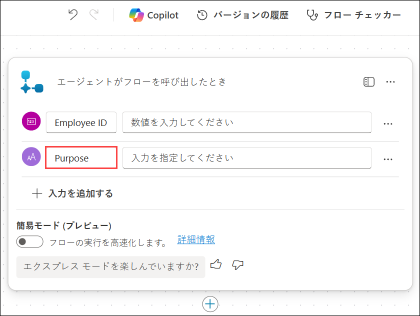

## タスク 2: フロー アクションの設定と Teams メッセージの投稿

このタスクでは、Microsoft Teams アクション、動的コンテンツ、応答処理を追加し、出張承認フローを公開して名前を付けます。

1. トリガー ノードの下の **[追加]** アイコンをクリックして、ワークフロー自動化に新しいアクション ステップを挿入します。

   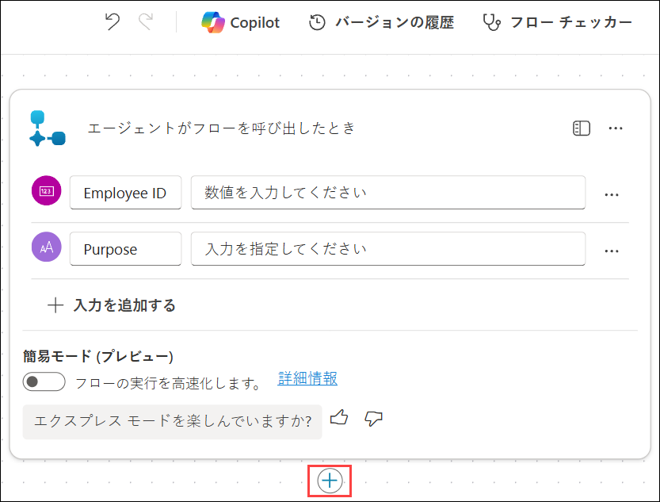

1. テキスト ボックスに **[チャットまたはチャネルにメッセージを投稿 (1)]** と入力して Microsoft Teams 統合を検索し、利用可能な Microsoft Teams アクションから選択します **(2)**。

   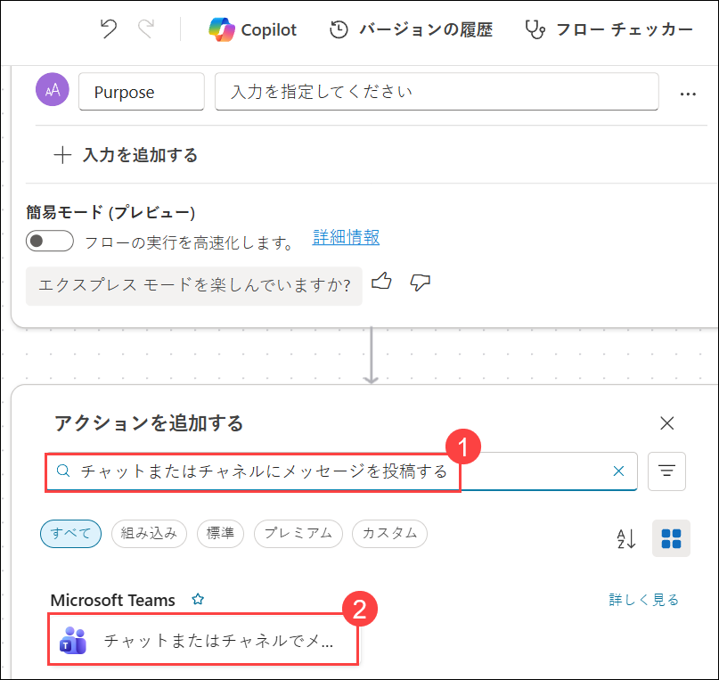

1. **[サインイン]** を選択して認証を行い、ワークフロー統合のために Microsoft Teams 接続を確立します。

   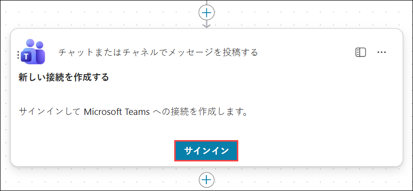

1. **ODL_User (1)** アカウントの資格情報を選択して認証し、Microsoft Teams 接続を確立します。

   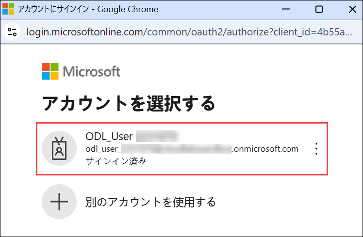

1. 次のウィンドウで、**[アクセスを許可]** をクリックして、エージェントへの接続アクセスを許可します。

   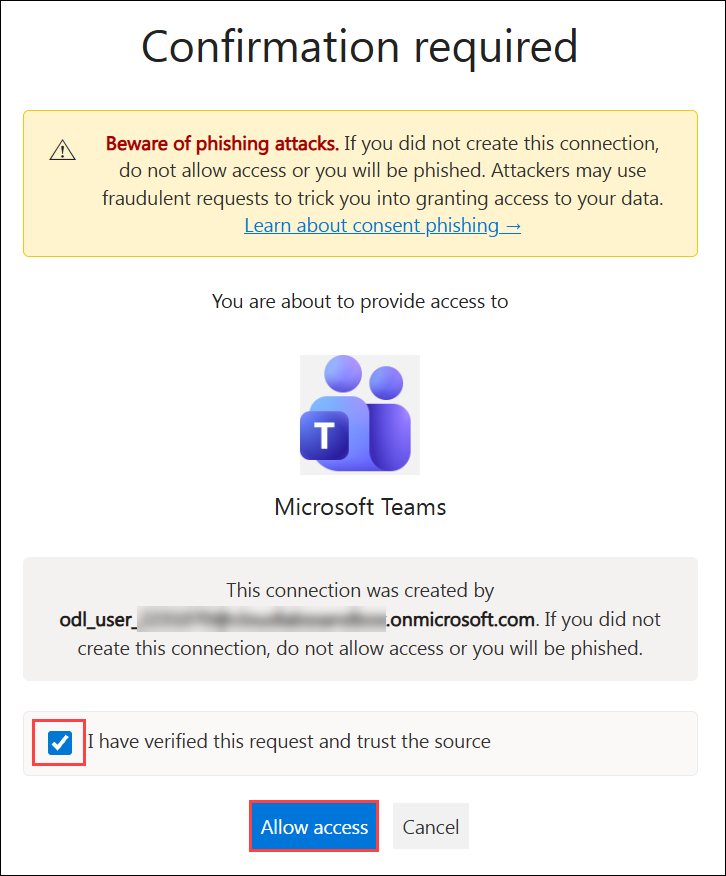

1. 以下のパラメーターで Teams メッセージ投稿アクションを設定します。

   | 項目 | 値 |
   |-----|-------|
   | Post as **(1)** | Flow bot |
   | Post in **(2)** | Channel |
   | Team **(3)** | HR Team |
   | Channel **(4)** | Travel Approvals |
   | Message **(5)** | `Travel request from Employee ID: [Employee ID], Purpose: [Purpose]` |

   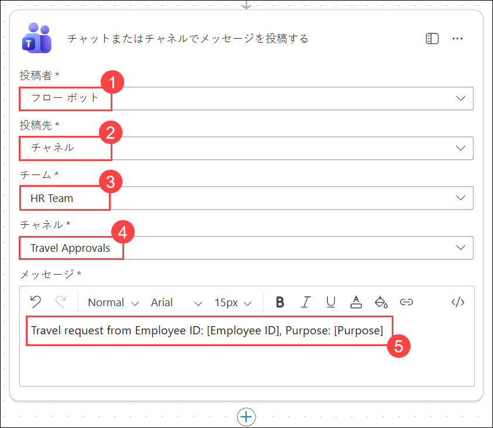

   > **Teams 統合のメリット:** この設定により、出張承認リクエストが指定された HR チーム チャネルに自動的に投稿され、適切な監査証跡を持つ集中型の承認ワークフローが作成されます。

1. メッセージ ボックスの **[Employee ID] (1)** をハイライトし、**[動的コンテンツ (2)]** アイコンをクリックして Employee ID 変数を挿入します。

   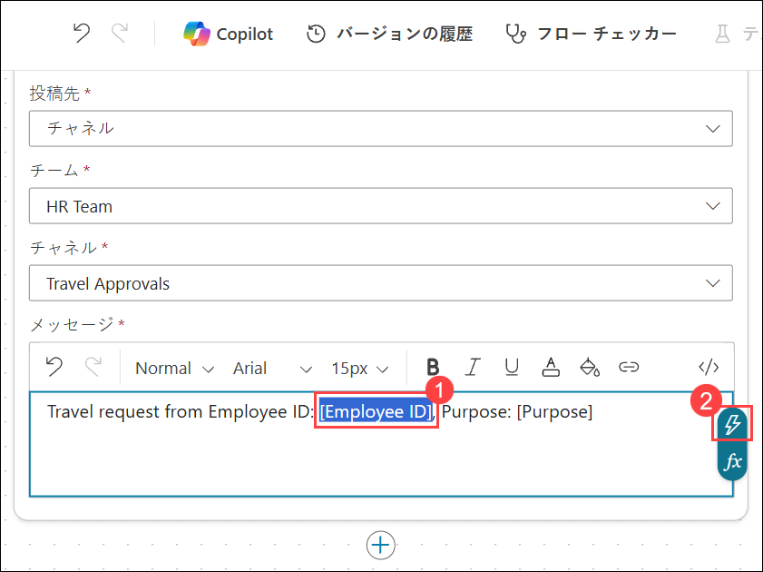

1. **[動的コンテンツ]** パネルで、「エージェントがフローを呼び出したとき」セクションの下にある **[Employee ID]** を選択します。

   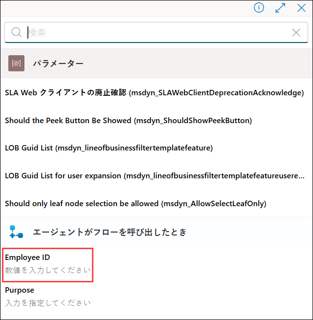

1. メッセージの **[Purpose] (1)** をハイライトし、**[動的コンテンツ (2)]** アイコンをクリックして Purpose 変数を挿入します。

   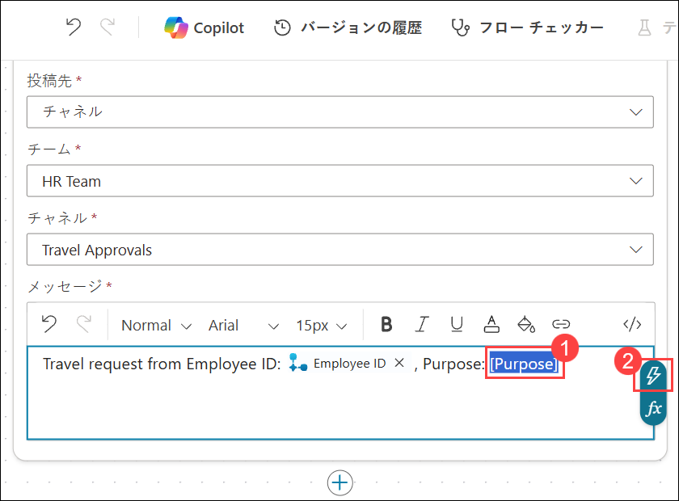

1. **Employee ID** と **Purpose (1)** の両方の動的な値が正しく追加されていることを確認したら、**[追加 (2)]** アイコンをクリックして次のアクションを挿入します。

   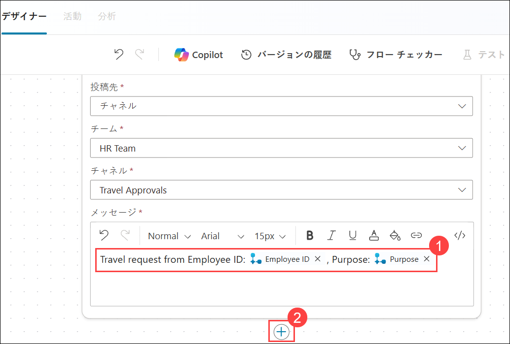

1. **[アクションの追加]** ウィンドウで、**[スキル (1)]** を検索し、**[エージェントへの応答 (2)]** を選択します。

   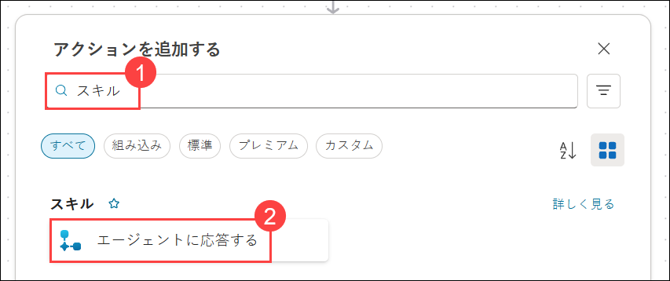

1. **[エージェントへの応答]** アクションの下の **[出力の追加 (1)]** をクリックして、返答メッセージを定義します。

   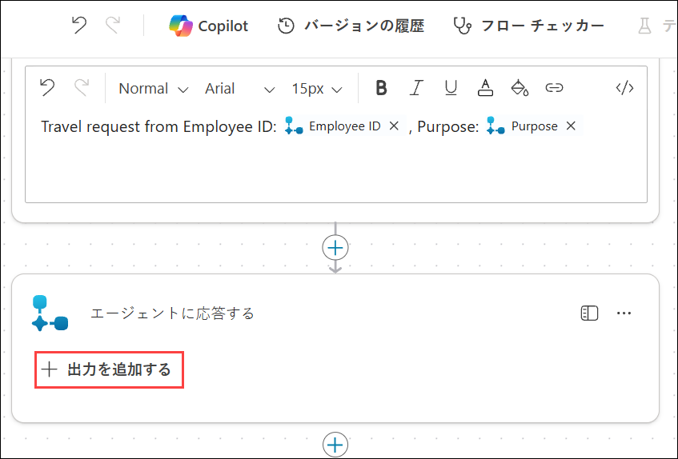

1. エージェントへの応答の出力タイプとして **[テキスト (1)]** を選択します。

   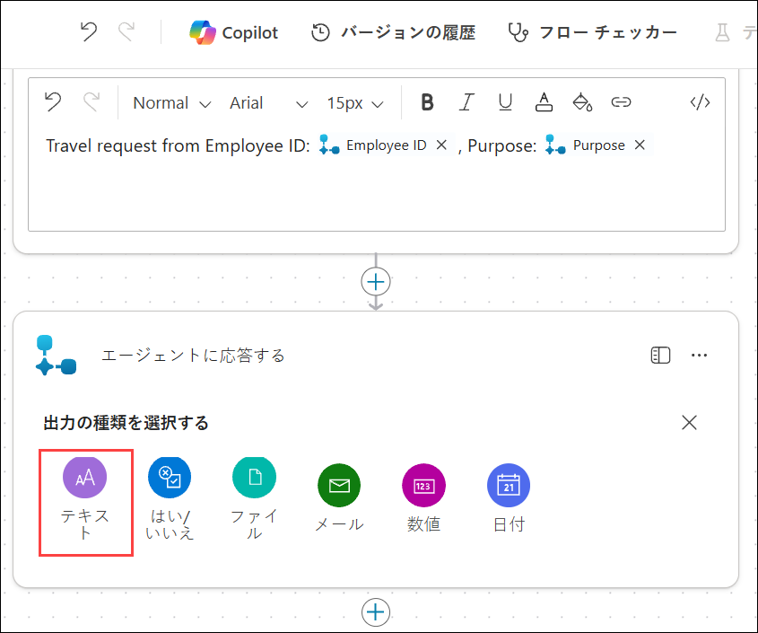

1. 出力設定に以下の詳細を入力します。

   | 項目 | 値 |
   |-----|-------|
   | Name **(1)** | `Output` |
   | Value **(2)** | `Request submitted` |
   | Description **(3)** | `Confirmation message for travel request` |

   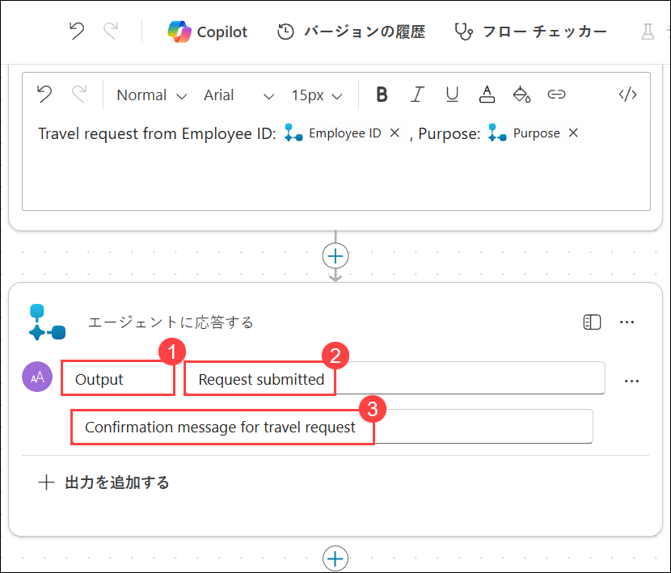

1. **[下書きの保存 (1)]** をクリックして、現在のフロー設定を公開前に保存します。

   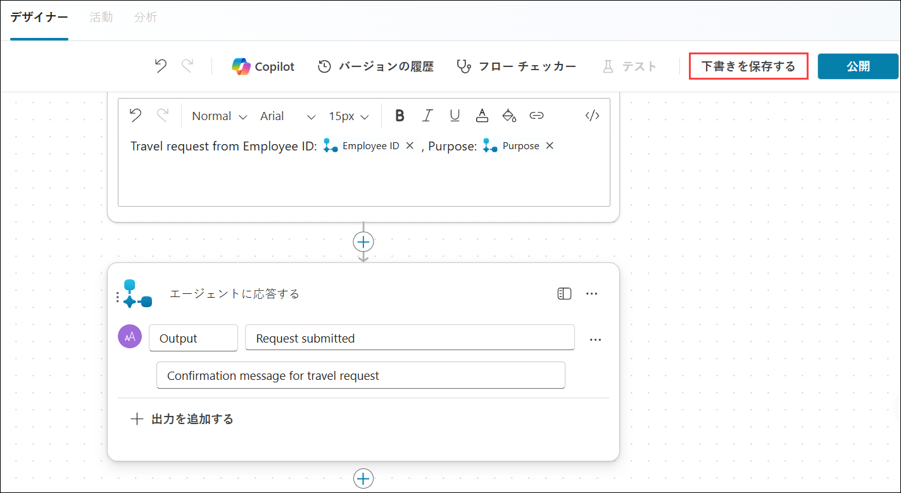

1. ページの上部に **「下書きフローを保存しました。公開後にテストして実行できます。」** という確認メッセージが表示されることを確認します。

   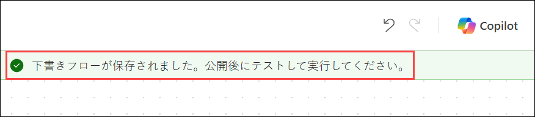

1. **[公開]** をクリックして、エージェント フローを使用可能にします。

   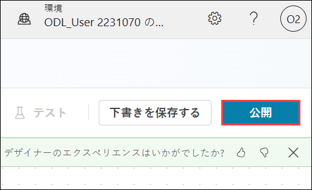

1. **[概要 (1)]** タブに移動し、**[編集 (2)]** をクリックしてエージェント フローの詳細を変更します。

   

1. フロー名として **Travel Approval Flow (1)** を入力し、**[保存 (2)]** をクリックして変更を適用します。

   

<validation step="79aacbd4-3125-426d-8b4f-fc9a29efaa87" />
 
> **タスクの完了、おめでとうございます!** 次は検証を行いましょう。以下の手順に従ってください。
> - 該当するタスクの [検証] ボタンをクリックしてください。成功メッセージが表示されたら、次のタスクに進むことができます。
> - 表示されない場合は、エラー メッセージをよく読んで手順を再確認し、ラボ ガイドの指示に従って再試行してください。
> - サポートが必要な場合は、cloudlabs-support@spektrasystems.com までお問い合わせください。24 時間 365 日対応しています。

## タスク 3: 出張承認フローのエージェントへの統合とテスト

このタスクでは、公開されたフローを Safe Travels エージェントの新しいトピックに接続し、変数をマッピングして更新を公開し、Teams での検証を含むエンドツーエンドの実行をテストします。

1. **Copilot Studio** で **Safe Travels Agent** を開き、ドロップダウン メニューから **[トピック (1)]** を選択します。

   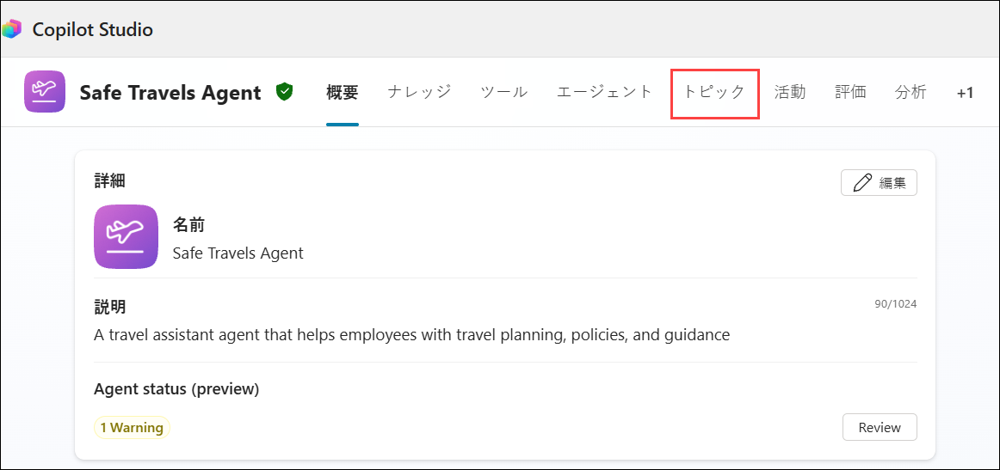

1. **[トピック]** タブで、**[トピックの追加 (1)]** をクリックし、ドロップダウン メニューから **[Copilot を使用して説明から追加 (2)]** を選択します。

   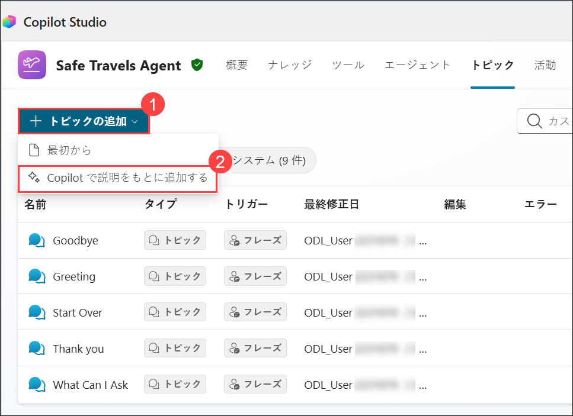

1. 以下の詳細で出張承認トピックを作成し、**[作成 (3)]** をクリックします。

   | 項目 | 値 |
   |-----|-------|
   | Name your topic **(1)** | `Travel Approval` |
   | Create a topic to... **(2)** | `This topic should get the Employee ID (Number) and Purpose of travel (Text) details from the user and invoke the Tool "Request Travel Approval Flow"` |

   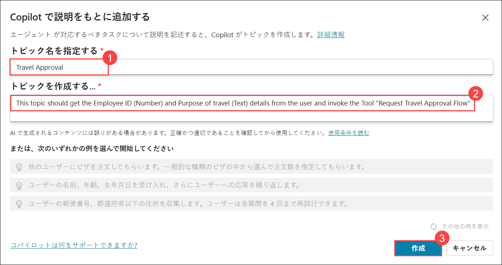

1. 既存のメッセージ ノードを次の手順で削除します。
   - **その他のオプション (1):** メッセージ ノードの**省略記号 (...)** アイコンをクリックします。
   - **削除 (2):** **[削除]** を選択してトピック フローからメッセージを削除します。

      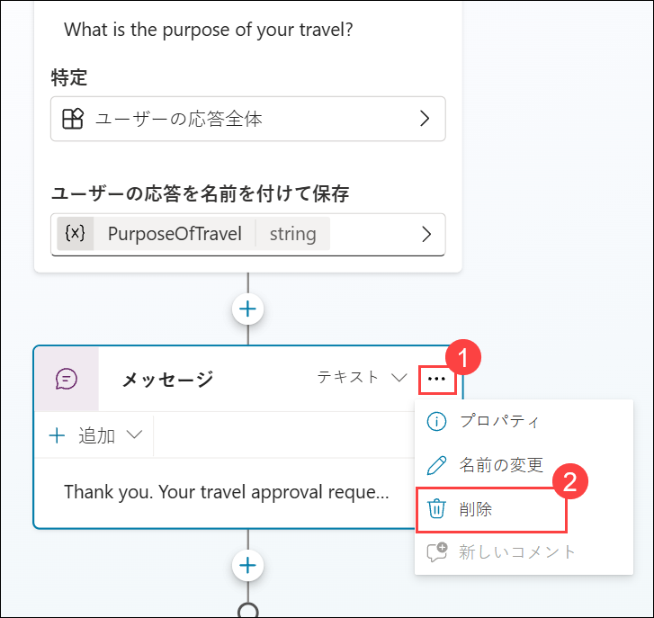

1. トピック作成キャンバスで、**[質問]** ノードの下の **プラス (+)** アイコンをクリックして新しいアクションを追加します。

   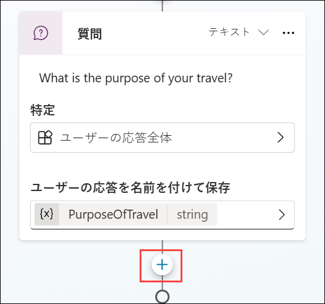

1. 出張承認フロー ツールを以下の手順で追加します。
   - **[ツールの追加 (1)]:** オプション メニューから **[ツールの追加]** を選択します。
   - **[Travel Approval Flow (2)]:** ツールの一覧から **[Travel Approval Flow]** を選択してトピックにリンクします。

      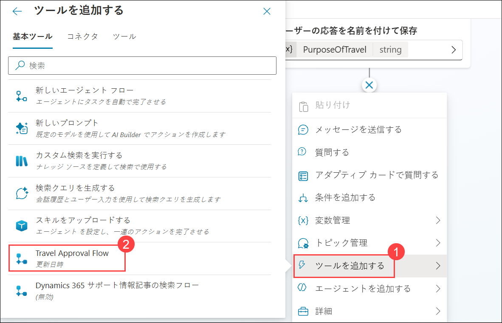

1. **[Power Automate の入力 (2)]** セクションで、**Employee ID (Number)** の横にある変数ピッカー **(1)** をクリックし、**[変数の選択]** パネルから **EmployeeID (2)** を選択します。

      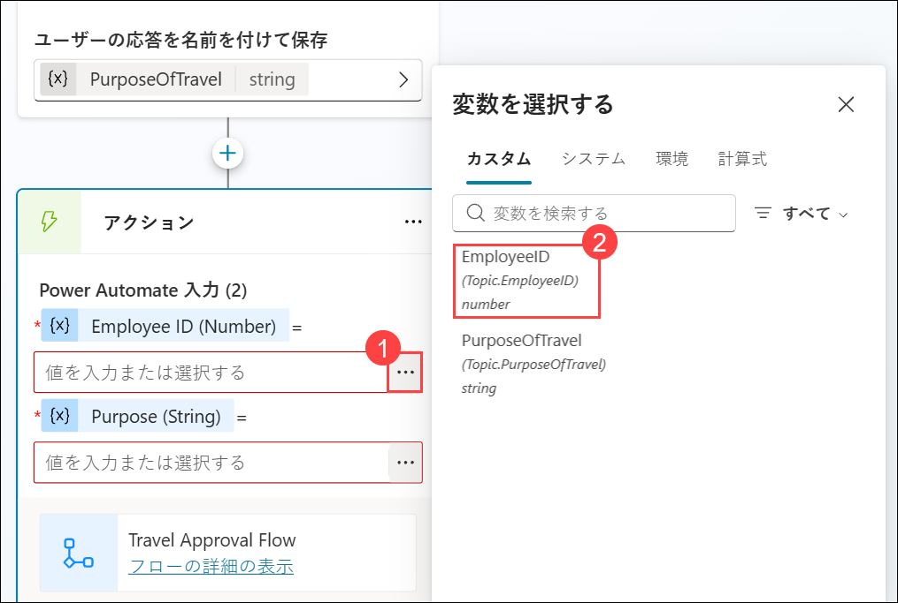

1. 同じ手順を行い、**Purpose (String)** フィールドに **PurposeOfTravel** を選択します。

1. 両方の変数が正しくマッピングされると、**Employee ID (Number)** が **EmployeeID** に、**Purpose (String)** が **PurposeOfTravel** にマッピングされた状態で表示されます。

   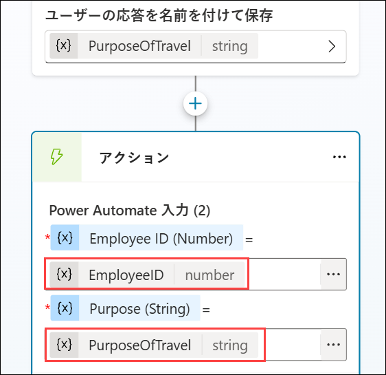

1. 出力のマッピング後、**[アクション]** ノードの下の **プラス (+)** アイコンをクリックして次の手順を追加します。
 
   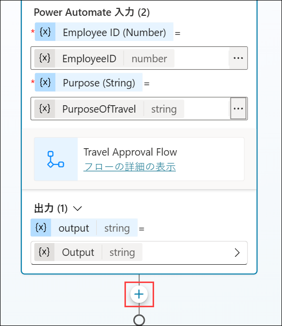

1. アクション メニューから **[メッセージの送信]** を選択して、ユーザーへの確認メッセージを表示します。
 
   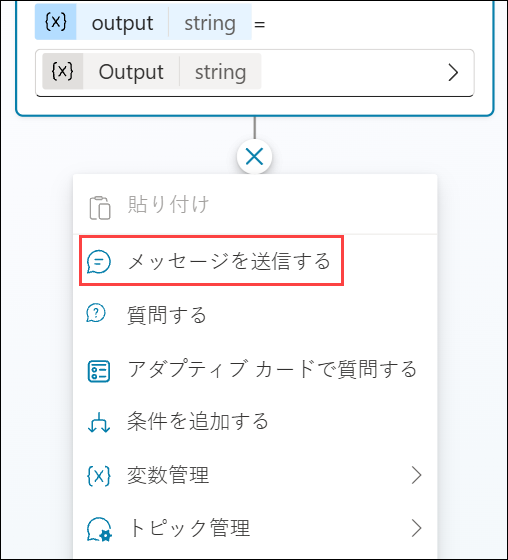

1. **[メッセージ]** ボックスで、**変数ピッカー (1)** をクリックし、一覧から **[Output (2)]** を選択してメッセージに挿入します。

   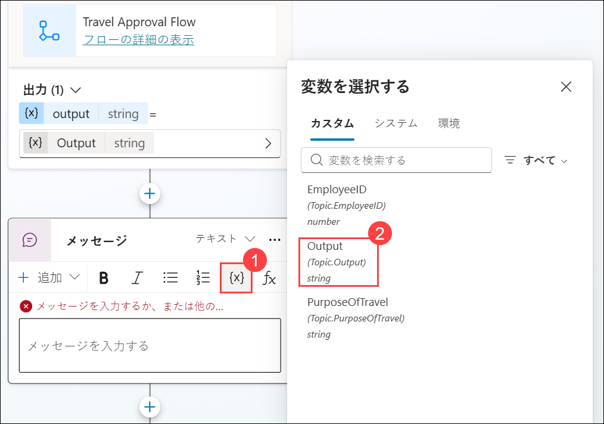

1. **[保存]** ボタンをクリックしてトピックの設定を保存します。

   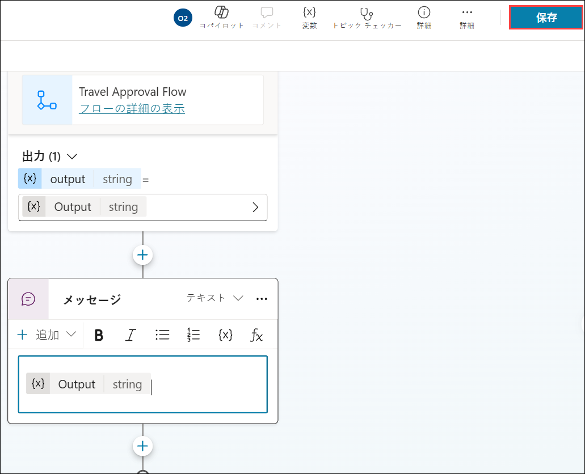

1. **[概要 (1)]** タブに移動し、**[公開 (2)]** をクリックしてエージェントの更新を反映させます。

1. **[このエージェントを公開]** ダイアログ ボックスで、**[公開]** をクリックして確定し、エージェントを展開します。

   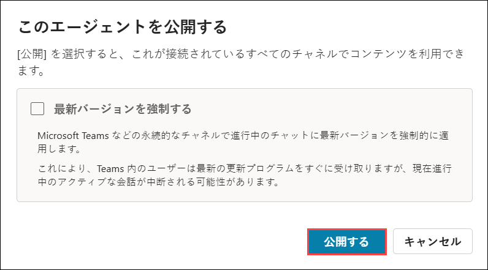

1. エージェントが正常に公開されたら、**[テスト]** をクリックして Copilot エージェントを確認および操作します。

   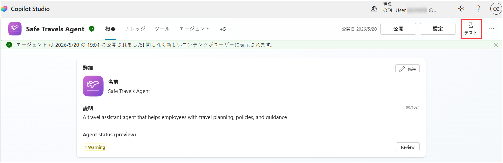

1. テスト チャットで次の**プロンプト (1)** を入力し、**[送信 (2)]** を選択します。

   ```
   I need travel approval
   ```

   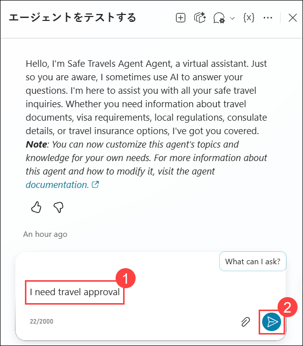

1. **「従業員 ID は何ですか?」** と質問されたら、次の**応答 (1)** を入力し、**[送信 (2)]** を選択します。

   ```
   117
   ```

   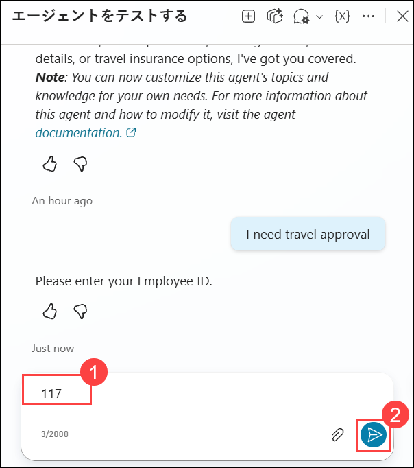

1. **「出張の目的は何ですか?」** と聞かれたら、次の**応答 (1)** を入力し、**[送信 (2)]** を選択します。

   ```
   Client meeting
   ```

   

1. Microsoft Teams の接続アクセスを求めるプロンプトが表示されたら、**[許可]** をクリックして統合を承認し、フローが Teams に出張リクエストを投稿できるようにします。

   

1. Microsoft Teams 接続が承認されたら、確認メッセージ **Request submitted** が表示されることを確認します。これは出張承認リクエストが正常に処理されたことを示します。

   

1. Microsoft Teams でメッセージが投稿されていることを以下の手順で確認します。
   - **[チャット (1)]:** **[チャット]** タブを開きます。
   - **[チーム (2)]:** **[HR Team]** を選択します。
   - **[チャネル (3)]:** **[Travel Approvals]** を開きます。
   - **[メッセージ (4)]:** 投稿が `Travel request from Employee ID: 117, Purpose: Client meeting` として表示されていることを確認します。

      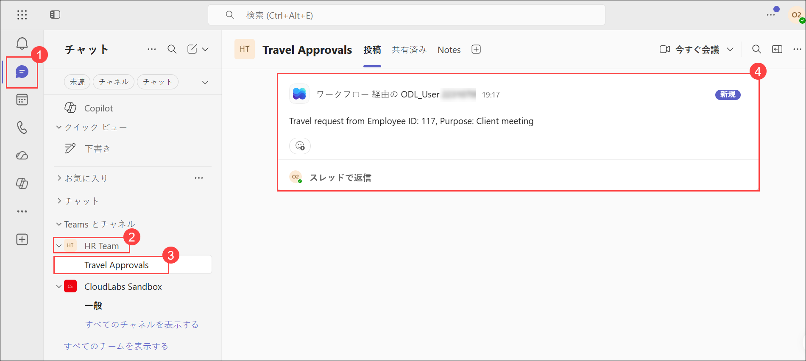

      > **フローの検証:** 出張承認フローのテストが成功すると、エージェントが実際のビジネス プロセスをトリガーし、エンタープライズ コラボレーション ツールと統合できることが確認されます。

## タスク 4: マルチエージェント オーケストレーションの確立

このタスクでは、分散 AI システムの強みを学びます。専門化されたエージェントが特定のビジネス ドメインを担当しながら、インテリジェントなルーティングと連携を通じて統一されたユーザー エクスペリエンスを維持します。

1. 左メニューから **[エージェント]** を選択して、**Leave Manager エージェント**に移動します。

   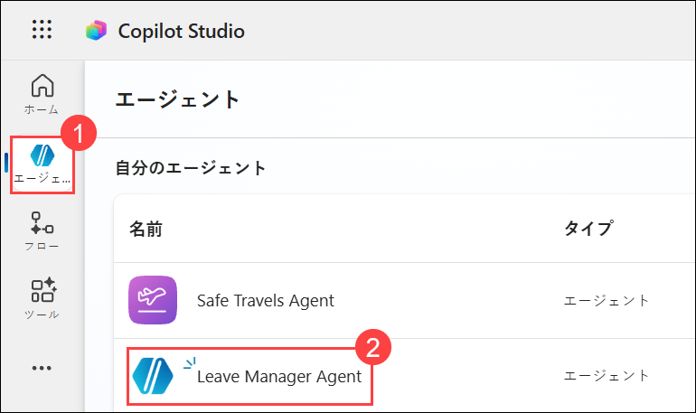

1. 上部の**メニュー**から **[トピック]** を選択して、エージェントの会話トピックを作成または管理します。

   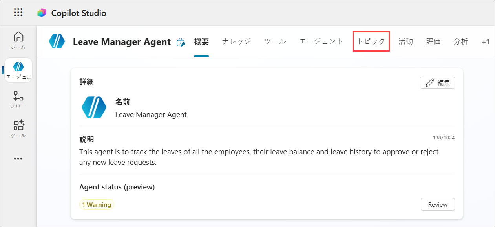

1. **[トピックの追加 (1)]** をクリックし、**[Copilot を使用して説明から追加 (2)]** を選択して、自然言語の説明からトピックを自動生成します。

   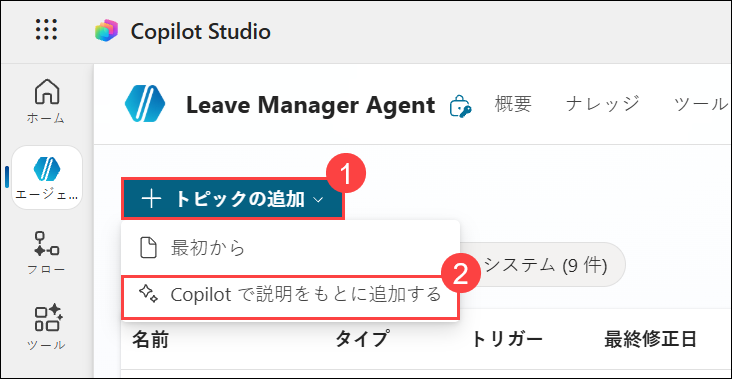

1. 以下の詳細で **Leave Balance Checker** トピックを作成し、**[作成 (3)]** をクリックします。

   | 項目 | 値 |
   |-----|-------|
   | Name your topic **(1)** | `Leave Balance Checker` |
   | Create a topic to... **(2)** | `Get the Employee ID from the user and check and reply with the leave balance based on the tracker added as knowledge source.` |

   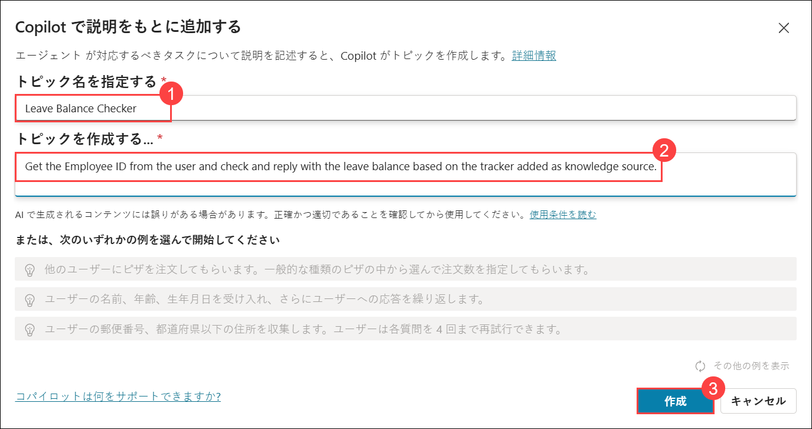

1. トピック フローを確認し、**メッセージ** ノードのメニューで **[...]** をクリックして **[削除]** を選択します。

   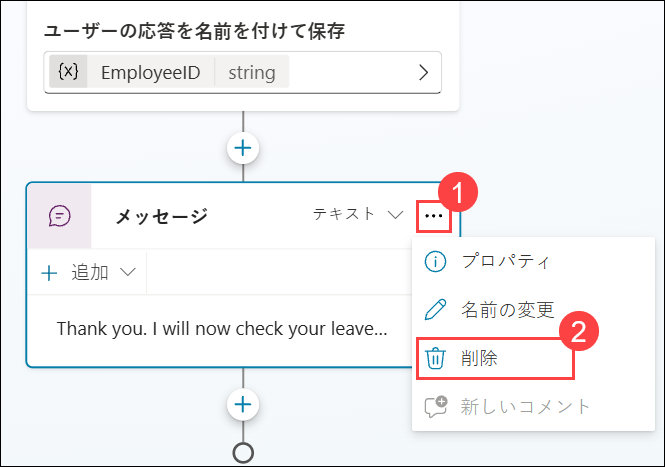

1. 完了したら、**[+]** をクリックして新しいノードを追加します。

   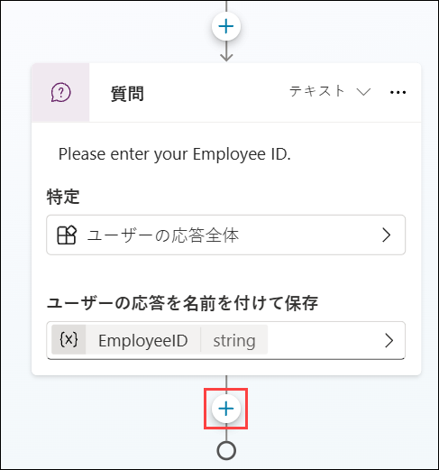

1. 一覧から **[詳細設定]** を選択し、**[生成型の回答]** をクリックします。

   

1. 生成型の回答ノードで **[...]** オプションを選択します。

   

1. 変数一覧から **EmployeeID** を選択します。

   

1. 完了したら、**[編集]** をクリックしてナレッジ ソースを設定します。

   

1. サイド パネルで **[選択したソースのみを検索]** オプションをオンにし、一覧から **Leave balance Tracker.xlsx** を選択します。

   

1. 設定が完了したら、上部メニューから **[保存]** をクリックしてトピックを保存します。

   

1. トピックを正常に保存したら、**[テスト]** をクリックしてテスト ウィンドウを開き、Leave Manager エージェントの応答フローを確認します。

   

1. テスト チャットで次の**プロンプト (1)** を入力し、**[送信 (2)]** を選択します。

   ```
   Check Leave balance
   ```

   

1. 入力を求められたら、次の**従業員 ID (1)** を入力し、**[送信 (2)]** を選択します。

   ```
   1234
   ```

   

1. Leave Manager エージェントが、従業員 ID 1234 (John Doe) の休暇残高が **2 日**であることを表示することを確認します **(1)**。これは、専門化されたエージェントがシームレスに連携するマルチエージェント オーケストレーションの実際の動作を示しています。

   

1. **[公開 (1)]** をクリックしてエージェントを公開します。

1. ダイアログ ボックスで再度 **[公開]** をクリックします。

   

1. 公開が完了したら、**Safe Travels Agent** に戻ります。

   

1. **[+5 (1)]** メニューをクリックして追加オプションにアクセスします。**[エージェント (2)]** を選択して、エージェントの管理またはトピック、アクティビティ、分析、チャネルなどの他の機能にアクセスします。

   

1. **[追加]** をクリックして、既存の Safe Travels Agent と連携する新しいエージェントを作成します。

   

1. 利用可能なエージェントから **Leave Manager Agent** を選択して接続します。

   

1. エージェントの設定を確認し、**[追加して設定]** をクリックして接続を完了します。

   

1. **Safe Travels Agent** インターフェースで、**[エージェント]** タブに移動し、**[設定]** をクリックしてエージェントの設定を構成します。

   

1. **[生成 AI (1)]** 設定に移動し、オーケストレーションに **[はい (2)]** が選択されていることを確認して、**[保存 (3)]** をクリックします。

   

1. **[エージェント (1)]** タブで **[Leave Manager Agent (2)]** を選択します。

   

1. **[公開]** をクリックして Leave Manager Agent を公開します。

   

1. 公開ダイアログで **[公開]** をクリックして確定します。

   

1. エージェント一覧から **[Safe Travels Agent (2)]** に戻ります。

   

1. **[公開]** をクリックして、接続された Leave Manager Agent を含む Safe Travels Agent を公開します。

   

1. 公開ダイアログで **[公開]** をクリックして確定します。

   

1. **[テスト]** をクリックして、**Safe Travels Agent** のエージェント機能をテストします。

1. テスト チャットで次の**プロンプト (1)** を入力し、**[送信 (2)]** を選択します。

   ```
   Check Leave balance
   ```

   

1. 入力を求められたら、次の**従業員 ID (1)** を入力し、**[送信 (2)]** を選択します。

   ```
   1234
   ```

   

   > **マルチエージェントの成功:** Safe Travels エージェントと Leave Manager エージェント間のシームレスなハンドオフは、オーケストレーションが成功したことを示しており、専門化されたエージェントが連携して包括的なビジネス ソリューションを提供しています。

<validation step="e50761be-041a-4631-8e82-ca3952b8aa3a" />
 
> **タスクの完了、おめでとうございます!** 次は検証を行いましょう。以下の手順に従ってください。
> - 該当するタスクの [検証] ボタンをクリックしてください。成功メッセージが表示されたら、次のタスクに進むことができます。
> - 表示されない場合は、エラー メッセージをよく読んで手順を再確認し、ラボ ガイドの指示に従って再試行してください。
> - サポートが必要な場合は、cloudlabs-support@spektrasystems.com までお問い合わせください。24 時間 365 日対応しています。

## まとめ

この演習では、会話型 AI システムを高度なビジネス自動化機能で強化することに成功しました。以下を達成しました。

- **包括的な出張承認ワークフローを作成し**、リアルタイムのビジネス プロセス自動化のために Microsoft Teams と統合しました。
- **組織のナレッジ ソースとドメイン固有の専門知識を持つ専門化された Leave Manager エージェントを構築**しました。
- **マルチエージェント オーケストレーションを確立**し、異なる AI エージェント間のシームレスな連携を実現しました。
- **会話の開始から Teams 通知およびエージェント間のルーティングまでのエンドツーエンドのビジネス プロセスを実装**しました。

### ラボが正常に完了しました!
