# マルチエージェント オーケストレーションによる Safe Travels エージェントの構築と強化

### 全体の推定所要時間: 1 時間

## 概要

このハンズオン ラボでは、Microsoft Copilot Studio を使用して Safe Travels エージェントを構築および設定し、従業員の出張計画、ポリシーの照会、および承認ワークフローをサポートします。このエージェントはマルチエージェント オーケストレーションを活用して、休暇残高照会などの専門タスクを専用の Leave Manager エージェントにシームレスに委任します。Microsoft Teams と Power Automate を統合することで、従業員エクスペリエンスを向上させ、ビジネス プロセスを効率化するインテリジェントな自動化システムを構築します。

## 目標

このラボを完了すると、以下のことができるようになります。

- **Safe Travels エージェントの作成と展開:** テンプレートを使用して出張支援エージェントを構築し、ナレッジ ソースを統合して Microsoft Teams に展開します。

- **ビジネス自動化のためのエージェント フローの実装:** 出張承認プロセスをトリガーし、Teams チャネルに通知を投稿する Power Automate フローを設計および設定します。

- **マルチエージェント オーケストレーションの構築:** 専門化された Leave Manager エージェントを作成し、複数のエージェント間の連携を有効化して包括的なビジネス ソリューションを実現します。

- **エンドツーエンド ワークフローのテスト:** エージェントの応答、フローの実行、エージェント間のハンドオフを検証して、安定した動作を確認します。

## 前提条件

- 会話型 AI およびエージェント AI の概念に関する基本的な理解
- Microsoft Copilot Studio の実務的な知識
- Microsoft Teams と Power Platform に関する基本的な知識

## コンポーネントの説明

- **Microsoft Copilot Studio:** 会話型 AI エージェントを構築、設定、および管理するためのプラットフォームです。

- **Dataverse:** 従業員情報、休暇残高、および出張ポリシーを保存する中央データ ストアです。

- **Power Platform 環境:** エージェント、データ テーブル、およびワークフローをホストするセキュアなワークスペースです。

- **Power Automate:** 出張承認プロセスおよび Teams 統合のためのワークフロー自動化エンジンです。

- **Microsoft Teams:** ユーザーがエージェントと対話し、承認通知を受け取るコラボレーション ハブです。

- **マルチエージェント オーケストレーション:** 専門化されたエージェントが連携し、リクエストをインテリジェントにルーティングするフレームワークです。

## ラボの開始

マルチエージェント オーケストレーションによる Safe Travels エージェントの構築と強化ラボへようこそ! インテリジェントな出張支援エージェントの構築、設定、およびテスト方法を探索・学習するためのシームレスな環境をご用意しています。このラボでは、AI エージェントの作成、ビジネス自動化ワークフローの実装、そしてマルチエージェント オーケストレーションの確立を通じて、安全で効率的なエクスペリエンスを提供する方法を学びます。

### ラボ環境へのアクセス

準備ができたら、Web ブラウザー内で仮想マシンとラボ ガイドをすぐにご利用いただけます。


### ラボ リソースの確認

ラボのリソースと資格情報をより深く理解するために、**[環境]** タブに移動してください。

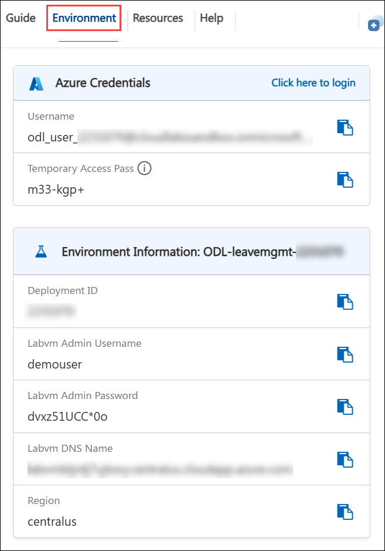

### 分割ウィンドウ機能の活用

便宜上、右上隅の **[ウィンドウの分割]** ボタンを選択することで、ラボ ガイドを別のウィンドウで開くことができます。

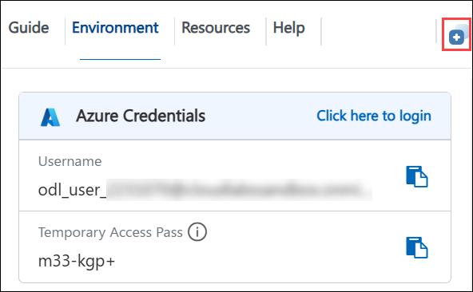

### 仮想マシンの管理

**[リソース (1)]** タブから、仮想マシンの**起動、停止、再起動、または接続 (2)** を簡単に行えます。


## Power Apps ポータルを起動しましょう

1. JumpVM で、デスクトップ上の **Microsoft Edge** ブラウザー ショートカットをクリックします。

   

1. 新しいブラウザー タブを開き、次の URL を入力して Power Apps ポータルに移動します。

   ```
   https://make.powerapps.com/
   ```

1. **[Microsoft にサインイン]** タブで、次のメール アドレス **(1)** をメール フィールドに入力し、**[次へ (2)]** をクリックして続行します。

   - メール アドレス: **<inject key="AzureAdUserEmail"></inject>**

     

1. **[一時アクセス パスの入力]** 画面で、次の**一時アクセス パス**を入力し、**[サインイン (2)]** をクリックします。

   - 一時アクセス パス: **<inject key="AzureAdUserPassword"></inject>**

     
     
1. **[サインインの状態を維持しますか?]** というポップアップが表示された場合は、**[いいえ]** をクリックします。

   

1. **[Power Apps へようこそ]** ポップアップが表示された場合は、既定の国/地域の選択のまま **[はじめる]** を選択します。

   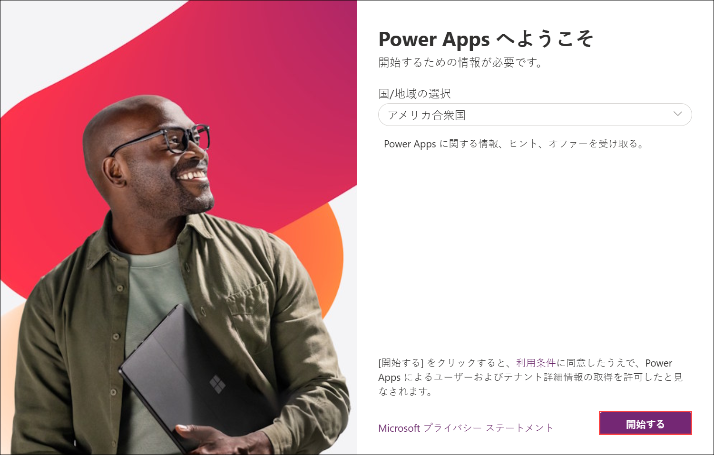

1. これで Power Apps ポータルへのサインインが完了しました。ポータルを開いたままにしてください。

   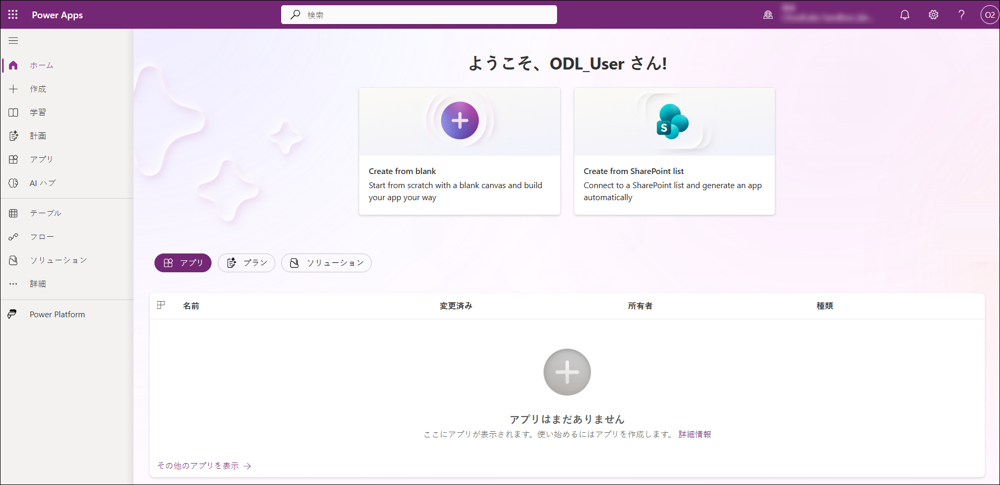

   > **注:** Power Apps ポータルにサインインするのは、次の手順で開発者環境を作成して使用するために必要な開発者ライセンスが自動的に付与されるためです。

1. 左メニューから **[テーブル (1)]** を選択し、**[Excel または .CSV ファイルで作成 (2)]** をクリックします。

   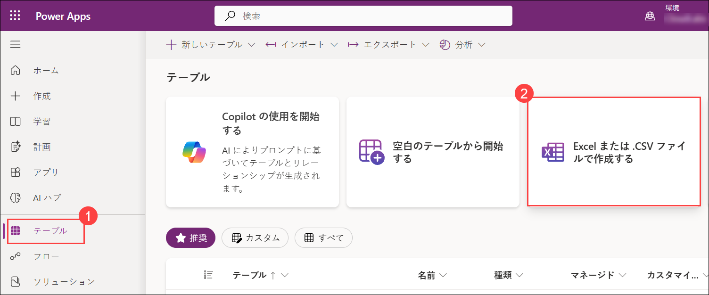

1. 環境を作成するポップアップ ウィンドウで、**[作成]** を選択します。これにより、新しい Power Platform 開発者環境が作成されます。

   > **注:** ここで作成する権限がないというメッセージが表示された場合は、環境の準備が整うまで時間がかかる場合があるため、数分待ってからページを更新してください。
   
1. **[Excel または .CSV ファイルのアップロード]** ウィンドウに直接移動した場合は、処理をキャンセルしてください。

1. 新しいブラウザー タブを開き、次の URL を入力して Power Platform 管理センターに移動します。

   ```
   https://admin.powerplatform.microsoft.com
   ```

1. **Power Platform 管理センター**で、**[管理 (1)]** を選択し、**[環境 (2)]** を選択して、**[ODL_User <inject key="DeploymentID" enableCopy="false"/> の環境 (3)]** を選択します。

   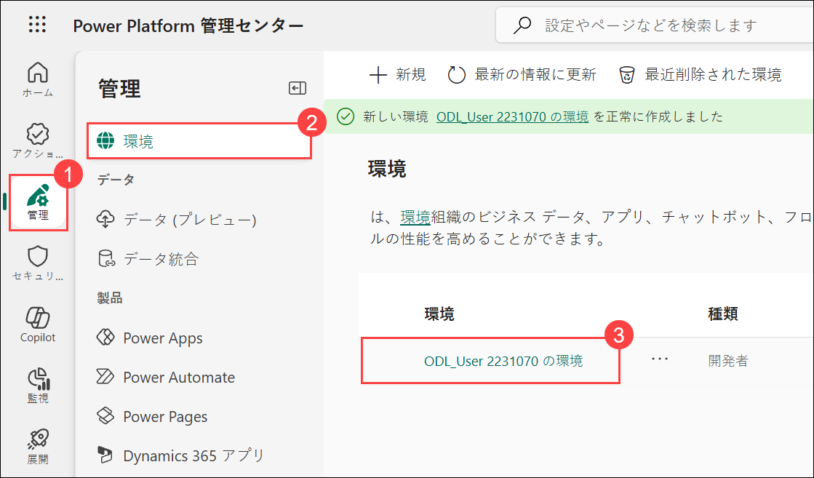

   >注: 環境が表示されない場合は、バックグラウンドで作成中の可能性があります。これは Power Platform における想定された動作です。15 ～ 20 分待ってからページを更新して環境を確認してください。

1. 環境ページで、**[S2S アプリ]** の下にある **[すべて表示]** を選択します。

   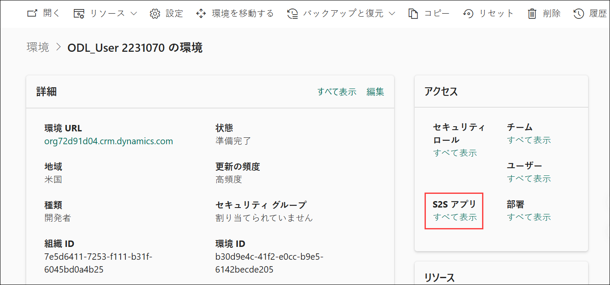

1. 次のウィンドウで、**[+ 新しいアプリ ユーザー]** を選択します。

   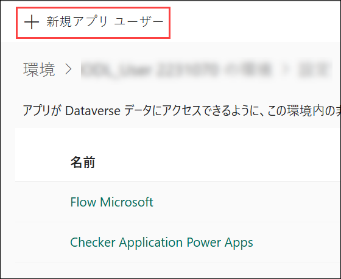

1. **[新しいアプリ ユーザーの作成]** ウィンドウで、**[アプリ]** の下にある **[+ アプリの追加]** を選択します。

   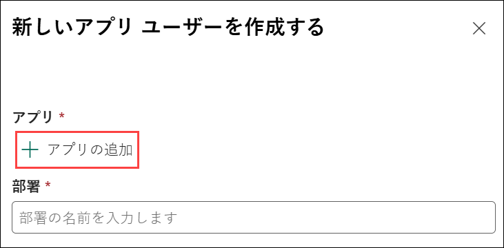

1. **[Microsoft Entra ID からアプリを追加]** ウィンドウで、検索ボックスに以下の URL を入力し **(1)**、結果からアプリを選択して **(2)**、**[追加 (3)]** を選択します。

   ```
   https://cloudlabssandbox.onmicrosoft.com/cloudlabs.ai/
   ```

   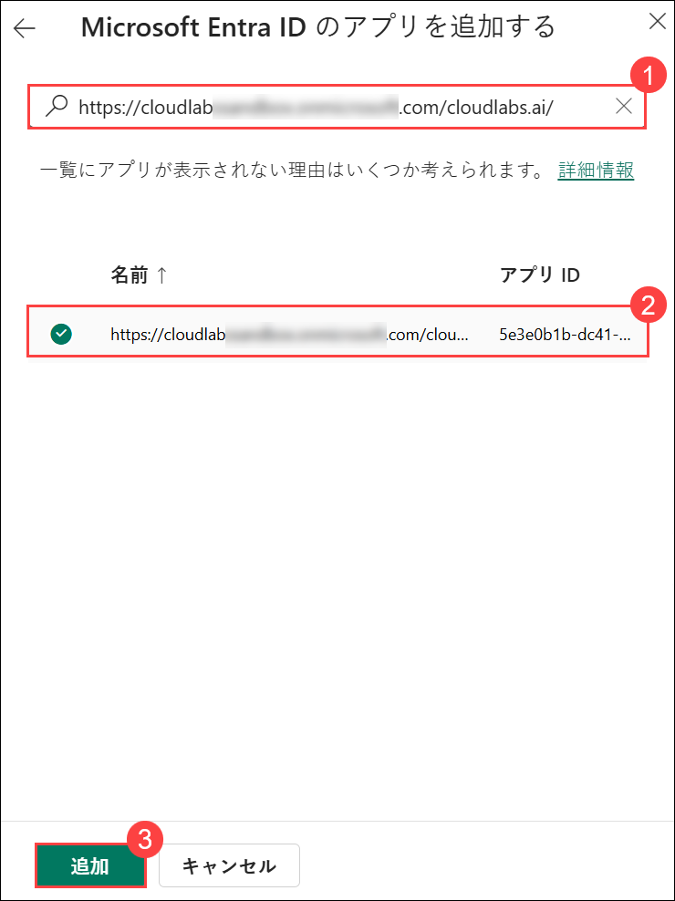

1. **[ビジネス ユニット]** の下で、テキスト入力フィールドをクリックして利用可能なオプションを表示し、一覧からいずれかのビジネス ユニットを選択します。

   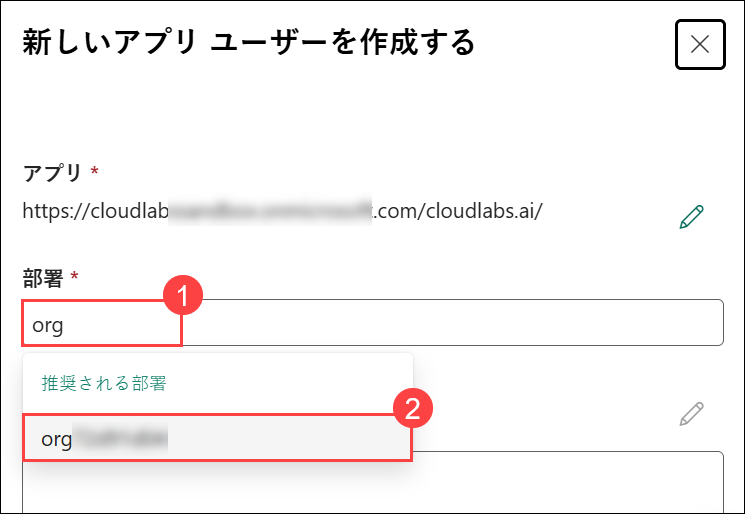

1. **[セキュリティ ロール]** の横にある **[編集]** アイコンを選択します。

   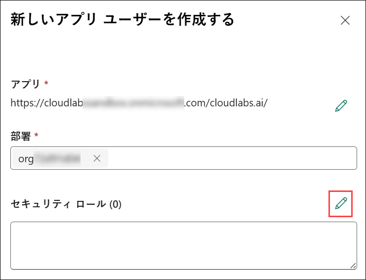

1. **[権限の同期]** ウィンドウで、**[システム管理者 (1)]** を選択し、**[保存 (2)]** を選択します。

   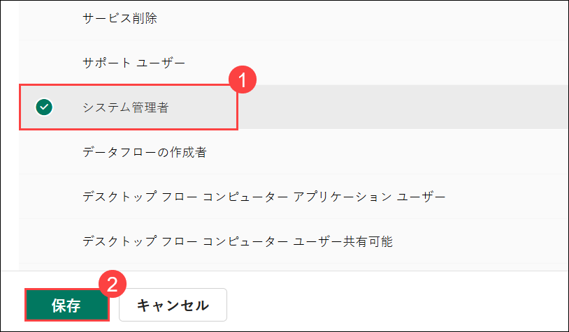

1. ポップアップ ウィンドウで **[保存]** を選択します。

   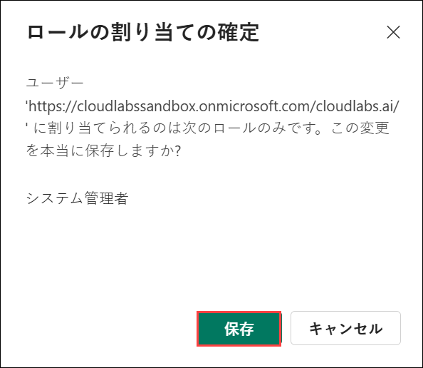

1. すべての詳細を確認し、**[作成]** を選択します。

   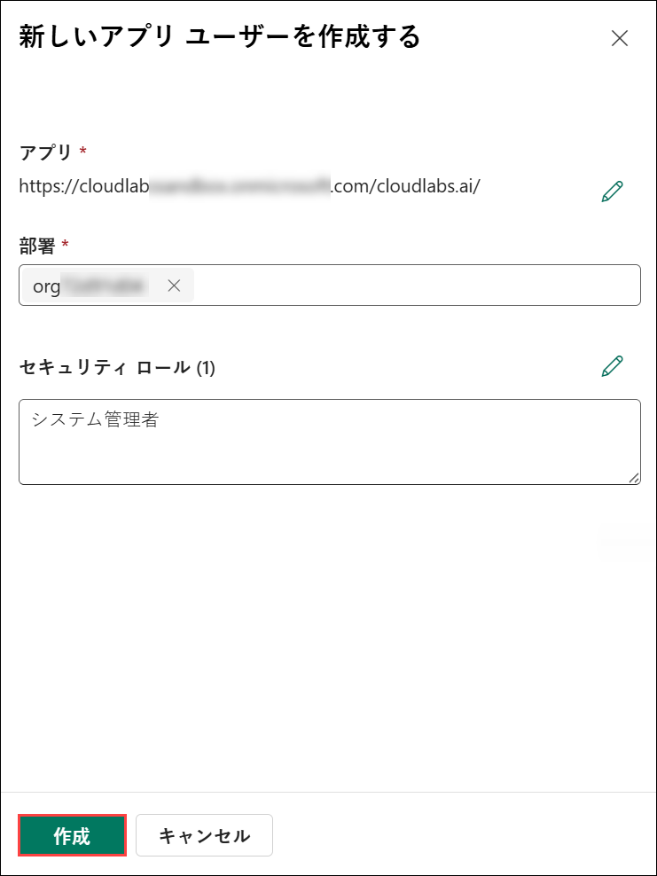

## サポート連絡先

CloudLabs サポート チームは、年中無休・24 時間体制でメールとライブ チャットによるサポートを提供しており、いつでもシームレスなサポートを受けることができます。学習者とインストラクターの両方に特化した専用サポート チャネルを提供しており、すべてのご要望に迅速かつ効率的に対応します。

学習者向けサポート連絡先:

- メール サポート: cloudlabs-support@spektrasystems.com
- ライブ チャット サポート: https://cloudlabs.ai/labs-support

右下隅の **[次へ]** をクリックして次のページに進んでください。

   

## ラーニングをお楽しみください!!
