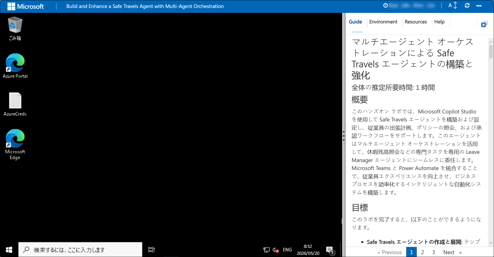
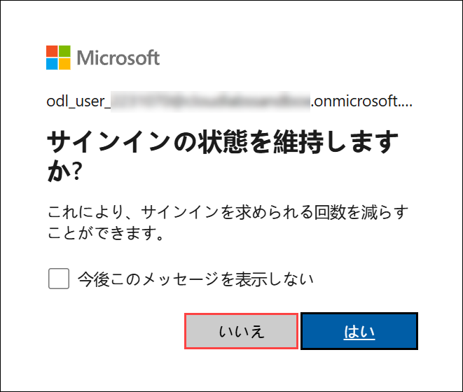

# Safe Travels Agent を構築・強化する（マルチエージェント オーケストレーション）

### 目安所要時間: 1 時間

## 概要

このハンズオン ラボでは、Microsoft Copilot Studio を使用して Safe Travels Agent を構築および構成し、従業員の旅行計画、ポリシーに関する質問、承認ワークフローを支援します。エージェントはマルチエージェント オーケストレーションを活用し、休暇残高照会などの専門的なタスクを専用の Leave Manager Agent にシームレスに委任します。Microsoft Teams と Power Automate を統合することにより、従業員体験を向上させ、ビジネス プロセスを効率化するインテリジェントで自動化されたシステムを構築します。

## 目的

このラボの終了時までに、次のことができるようになります:

- **Safe Travels Agent の作成と展開:** テンプレートを使用してトラベルアシスタント エージェントを構築し、ナレッジソースを統合し、Microsoft Teams に展開します。

- **ビジネス自動化のためのエージェントフローの実装:** トラベル承認プロセスをトリガーし、Teams チャネルに通知を投稿する Power Automate フローを設計および構成します。

- **マルチエージェント オーケストレーションの構築:** 専門の Leave Manager Agent を作成し、複数のエージェント間で協力して包括的なビジネス ソリューションを提供できるようにします。

- **エンドツーエンド ワークフローのテスト:** エージェントの応答、フローの実行、およびエージェント間の引き継ぎを検証して、信頼性の高い運用を確保します。

## 前提条件

- 会話型 AI とエージェント AI の基本概念の理解
- Microsoft Copilot Studio の実務的な知識
- Microsoft Teams と Power Platform に関する知識

## コンポーネントの説明

- **Microsoft Copilot Studio:** 会話型 AI エージェントを構築、構成、および管理するためのプラットフォーム。

- **Dataverse:** 従業員情報、休暇残高、および旅行ポリシーを保存する中央データストア。

- **Power Platform Environment:** エージェント、データテーブル、ワークフローをホストする安全なワークスペース。

- **Power Automate:** トラベル承認プロセスと Teams 統合のためのワークフロー自動化エンジン。

- **Microsoft Teams:** ユーザーがエージェントと対話し、承認通知を受け取るコラボレーション ハブ。

- **Multi-Agent Orchestration:** 専門エージェントが連携してリクエストをインテリジェントにルーティングするためのフレームワーク。

## ラボの開始方法

Build and Enhance a Safe Travels Agent with Multi-Agent Orchestration ラボへようこそ。シームレスな環境を用意しており、インテリジェントな旅行支援エージェントの構築、構成、およびテストを学ぶことができます。このラボでは、AI エージェントの作成、ビジネス自動化ワークフローの実装、マルチエージェント オーケストレーションの構築を案内し、安全で効率的な体験を提供します。

### ラボ環境へのアクセス

準備ができたら、仮想マシンとラボ ガイドがブラウザー内ですぐに利用できます。



### ラボ リソースの確認

Lab リソースと資格情報をよりよく理解するには、Environment タブに移動します。


### Split Window 機能の利用

便利なように、右上の Split Window ボタンを選択してラボ ガイドを別ウィンドウで開くことができます。


### 仮想マシンの管理

**Resources (1)** タブから、仮想マシンを **開始、停止、再起動、または接続 (2)** することができます。操作はすべてあなたの手の中にあります。


## Power Apps ポータルを使い始める

1. JumpVM で、デスクトップにある **Microsoft Edge** ブラウザーのショートカットをクリックします。

   

1. 新しいブラウザー タブを開き、次の URL を入力して Power Apps ポータルに移動します。

   ```
   https://make.powerapps.com/
   ```

1. **Sign into Microsoft** タブで、メールフィールドに次のメールアドレス **(1)** を入力し、**Next (2)** をクリックして進みます。

   - Email: **<inject key="AzureAdUserEmail"></inject>**

     

1. **Enter Temporary Access Pass** 画面で、次の **Temporary Access Pass** を入力し、**Sign in (2)** をクリックします。

   - Temporary Access Pass: **<inject key="AzureAdUserPassword"></inject>**

     
     
1. **Stay Signed in?** ポップアップが表示されたら、**No** をクリックします。

   

1. **Welcome to Power Apps** ポップアップが表示された場合は、国/地域のデフォルト選択をそのままにして、**Get started** をクリックします。

   

1. これで Power Apps ポータルへのサインインが完了しました。ポータルは開いたままにしておきます。

   

   > **Note:** Power Apps ポータルにサインインすることで Developer ライセンスが自動的に割り当てられ、次の手順で Developer 環境を作成および使用するために必要になります。

1. 新しいブラウザー タブを開き、次の URL を入力して Power Platform 管理センターに移動します。

   ```
   https://admin.powerplatform.microsoft.com
   ```

1. **Power Platform 管理センター** で、左のナビゲーション ペインから **Manage** を選択します。

   

1. Power Platform 管理センターで、左のナビゲーション ペインから **Environments (1)** を選択し、**New (2)** を選択して新しい環境を作成します。

   

1. **New environment** ペインで次の設定を行い、**Next (3)** を選択します:

   - **Type** ドロップダウンから **Developer (1)** を選択します。
   - **Name (2)** フィールドに **ODL_User <inject key="DeploymentID" enableCopy="false"></inject>'s Environment** を入力します。

      

1. **Add Dataverse** ペインでは、すべての設定をデフォルトのままにして、**Save** を選択します。

   

   > **Environment Foundation:** この手順は、会社固有のデータとナレッジ ソースをサポートする基盤環境を作成します。

   > **Note:** 環境のプロビジョニングには 10〜15 分かかる場合があります。ステータスが準備完了になるまで待ってから次に進んでください。

   > **Note:** 環境リストが表示できないというエラーが表示される場合、それは環境がバックグラウンドで作成されている間に発生することがあります。10〜15 分後にブラウザーを更新すると、環境が表示されるはずです。

1. **Power Platform 管理センター** で **Manage (1)** を選択し、**Environments (2)** を選択してから **ODL_User <inject key="DeploymentID" enableCopy="false"/>'s Environment (3)** をクリックします。

   

1. 環境ページで、**S2S apps** の下にある **See all** をクリックします。

   

1. 次のペインで、**+ New app user** をクリックします。

   

1. [Create a new app user] ペインで、**App** の下にある **+ Add an app** をクリックします。

   

1. **Microsoft Entra ID からアプリを追加** ペインで、次の URL を検索ボックス **(1)** に入力し、検索結果からアプリを選択 **(2)** して **Add (3)** をクリックします。

   ```
   https://cloudlabssandbox.onmicrosoft.com/cloudlabs.ai/
   ```

   

1. **Business unit** で、検索ボックスに **org (1)** を入力し、リストから利用可能なビジネス ユニットを選択します **(2)**。

   

1. **Security roles** の横にある **Edit** アイコンをクリックします。

   

1. **Sync Permissions** ペインで **System Administrator (1)** を選択し、**Save (2)** をクリックします。

   

1. ポップアップ ウィンドウで **save** を選択します。

   

1. すべての詳細を確認し、**Create** をクリックします。

   

## サポート連絡先

CloudLabs のサポートチームは、24 時間 365 日、メールおよびライブ チャットでいつでもスムーズな支援を提供します。学習者と講師の両方に特化した専用サポート チャネルを用意しており、あらゆるニーズに迅速かつ効率的に対応します。

学習者サポート連絡先:

- Email Support: cloudlabs-support@spektrasystems.com
- Live Chat Support: https://cloudlabs.ai/labs-support

画面右下の **Next** をクリックして次のページに進んでください。

   

## Happy Learning!!
